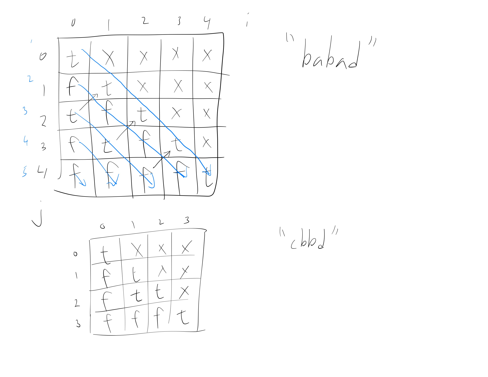

[Problem](https://leetcode.com/problems/longest-palindromic-substring/)

## takeaway
- Filling in the base cases for DP can reduce unneccessary branching and
  also make handling boundaries easier.
- When doing DP, traverse along rows if possible to maximize data locality.

## useful info
- `s` is alphanumeric
- there can be multiple valid answers, e.g. "babad" can return "bab" or "aba"
- for a string of length 1, that string will be returned, e.g. "a" -> "a"
- s.length() >= 1, so we don't have to handle the empty string

## thought process
- might have to handle even and odd case differently
    - odd-length inputs have a midpoint, but even-length inputs don't
- a naive brute force approach:
    - starting at each index, look to the left and the right, and if the
      substring is not a palindrome or if we reached the end of the string,
      move on to the next index, keeping track of the maximum length
    - we're interested in the actual palindrome, not just the maximum length
    - will have time complexity of O(n^2)?
- is there a data structure we can leverage on to reduce the time complexity?
- stack could be a good candidate for the structure of the problem
- using a set to find repeated element won't do, because can't check symmetry
- two-pointer approach of narrowing down from the start at the end could work
- if char at i and j are different increment i or decrement j
- how do we determine whether to inc i or dec j?
- could we try both in a subproblem solving manner? won't this approach have
  time complexity of O(n^2) though?
- how many contiguous substrings? O(n^2) since sum of arithmetic series
- so two-pointer approach starting at the ends could be an efficient approach
- but how can we handle the case wherer char at i and j are the same?
    - e.g. "dabcd" will have the same char at indices 0 and 4, but that does't
      mean much, as the inner substring is not a palindrome
- what a about a two-pointer approach starting in the middle and expanding?
- this could be identical to the initial naive approach though...
- e.g. "abbaxyz" -> answer is "abba" but if we start at the middle, won't reach
- how can we save computation?
- "abcdefedcba" if we start at the leftmost char, how we do process each char?
    - stack is empty, insert 'a'
    - 'b' is not the same as the top of the stack, insert
    - continue until we encounter the top of the stack or the one below
    - e.g. "abba": top of the stack, or "abcba": one below
    - continue popping of the stack and comparing with the next char
    - but looking at one below the top of the stack is quite awkward...
- could we leverage on the count of the characters and indices?
    - e.g. "babad" - 'a': 2, 'b': 2, 'd':1
    - e.g. "aaabaaa"
    - e.g. "aaaba"
    - not easy...
- the one I thought is the naive brute force solution could be the right
  approach? A naiver approach would be looking at all O(n^2) contigous
  substrings and checking if they are palindromes (takes O(n)) and the overall
  time complexity will be O(n^3), whereas iterating over the string and
  starting at each index (O(n)) and expanding while checking if panlindrome
  (O(n)) will yield the overall time complexity of O(n^2)
- handling encountering of the end of string might be tricky though
- also handling both odd and even cases is very tricky
- alternatively, we could thinking of dividing into subproblems, e.g. the
  longest palindrome of a string is 1. the whole string, 2. the longest
  palindrome of s[:-1], or 3. the longest palindrome of s[1:]
- but isn't that the same as the naive brute force approach? hmm...
- if s is a palindrome, s.substring(1, s.length() - 1) is also a palindrome, if
  s.length() > 2 and s.charAt(0) == s.charAt(s.length())
- conversely, s is a palinedrome if:
    1. s.length() == 1
    2. s.length() == 2 and s.charAt(0) == s.charAt(1)
    3. s.substring(1, s.length() - 1) and s.charAt(0) == s.charAt(s.length())
- instead of checking if a string `s` is a palinedrome in linear time, we
  should apply the above idea in DP fashion to check in constant time
- then the overall time complexity is going to be quadratic instead of cubic
- a typical DP approach will allocate a table, i.e. a 2D array
- the order of traversal might matter...
- we only have to consider the cases wherer i <= j

- we want to traverse following the blue line
- handle zigzag traversal...
- is it possible to keep track of the maximum length in the process? yes!

## edge cases
- DP approach really simplifies the problem; don't have to handle all the
  boundaries, even vs odd cases, etc...

## submission 1
```java
public String longestPalindrome(String s) {
    String result = "";
    int len = s.length();
    boolean[][] dp = new boolean[len][len];
    for (int k = 0; k < len; k++) {
        for (int i = 0; i < len - k; i++) {
            int j = i + k;
            if (i == j) {
                dp[i][j] = true;
            } else if (i + 1 == j) {
                dp[i][j] = s.charAt(i) == s.charAt(j);
            } else {
                dp[i][j] = dp[i + 1][j - 1] && s.charAt(i) == s.charAt(j);
            }
            if (dp[i][j] && j - i + 1 > result.length()) {
                result = s.substring(i, j + 1); // upper-bound exclusive
            }
        }
    }
    return result;
}
```
- Time
    - O(n^2): O(n^2) contiguous substrings, O(1) palindrome check
- Space
    - O(n^2) for the 2D table
- Result
    - Accepted
- Note
    - DP approach seems to be quite slow, despite the optimal time complexity.

## take 2
```python
def longest_palindrome(self, s: str) -> str:
    l = len(s)
    dp = [[False] * l for _ in range(l)]
    lo, hi = 0, 0

    # fill in the base cases
    for i in range(l - 1):
        dp[i][i] = True
        j = i + 1
        if s[i] == s[j]:
            dp[i][j] = True
            if j - i > hi - lo:
                lo, hi = i, j
    dp[l-1][l-1] = True

    # solve dp
    for k in range(l - 2, 0, -1):
        j = l - k
        for i in range(j - 2 + 1):
            if dp[i+1][j-1] and s[i] == s[j]:
                dp[i][j] =  True
                if j - i > hi - lo:
                    lo, hi = i, j
    return s[lo:hi+1]  # include char at hi
```
- Result
    - Accepted
- Note
    - Filling in the base cases for DP can reduce unneccessary branching and
      also make handling boundaries easier.
    - When doing DP, traverse along rows if possible to maximize data locality.

## take 3
```python
def longest_palindrome(self, s: str) -> str:
    def expand_around_center(s: str, i: int, j:int) -> str:
        lo, hi = i, i
        while i >= 0 and j < len(s):
            if s[i] != s[j]:
                break;
            if j - i > hi - lo:
                lo, hi = i, j
            i -= 1
            j += 1
        return s[lo:hi+1]  # include char at hi

    l = []
    length = len(s)
    for i in range(length - 1):
        l.append(expand_around_center(s, i, i))
        l.append(expand_around_center(s, i, i + 1))
    l.append(expand_around_center(s, length - 1, length - 1))
    return max(l, key=lambda s: len(s))
```
- Result
    - Accepted
- Note
    - Constant space complexity, which is a significant improvement over the
      previous solution.

