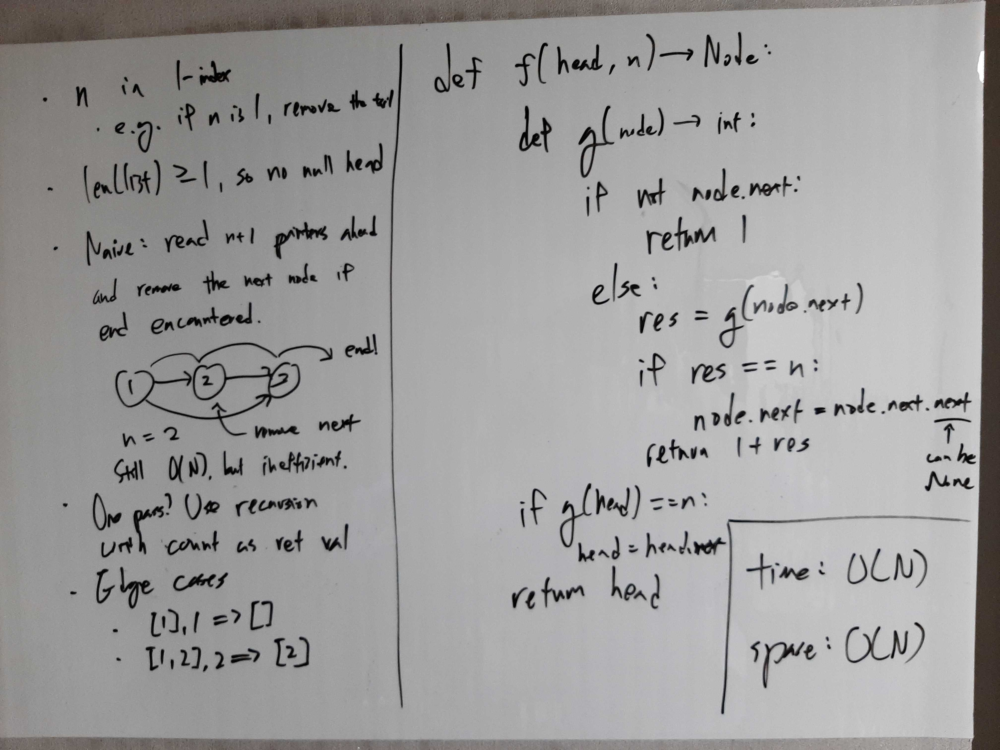

[Problem](https://leetcode.com/problems/remove-nth-node-from-end-of-list/)

## Algorithm Classification
- Linked List

## Takeaways
- Not much...?

## Take 1
- Approach
    - Define a helper recursive method that:
        - returns the distance from tail.
        - if the recursively returned distance == n, remove the next node.


- Code
```python
def removeNthFromEnd(self, head: ListNode, n: int) -> ListNode:
    def helper(node: ListNode) -> int:
        if not node.next:  # node is never None
            return 1
        else:
            distance = helper(node.next)
            if distance == n:
                node.next = node.next.next
            return 1 + distance

    distance = helper(head)
    if distance == n:
        head = head.next
    return head
```
- Time: O(N)
- Space: O(N)
- Result: Accepted

