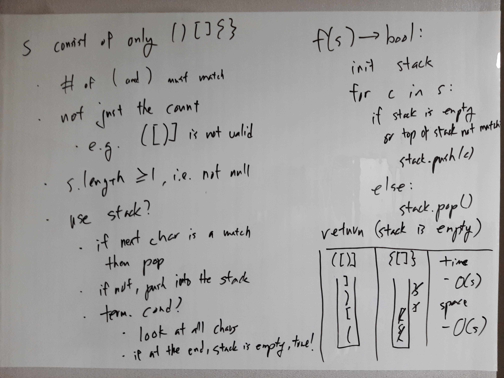

[Problem](https://leetcode.com/problems/valid-parentheses/)

## takeaway
- Finding the right data structure is the key to many problems.

## take 1

- code:
```java
public boolean isValid(String s) {
    Deque<Character> stack = new ArrayDeque<>();
    for (char c : s.toCharArray()) {
        if (stack.isEmpty() || !validMatch(stack.peek(), c)) {
            stack.push(c);
        } else {
            stack.pop();
        }
    }
    return stack.isEmpty();
}

private boolean validMatch(char l, char r) {
    return l == '(' && r == ')'
        || l == '[' && r == ']'
        || l == '{' && r == '}';
}
```
- Result
    - Accepted

## take
- Python version
```python
def isValid(self, s: str) -> bool:
    stack = []
    for c in s:
        if c == '(' or c == '{' or c == '[':
            stack.append(c)
        elif stack:
            if c == ')':
                if stack[-1] == '(':
                    stack.pop()
                else:
                    return False
            elif c == '}':
                if stack[-1] == '{':
                    stack.pop()
                else:
                    return False
            else:  # c == ']'
                if stack[-1] == '[':
                    stack.pop()
                else:
                    return False
        else:
            return False
    return not stack
```
- Time
    - O(S)
- Space
    - O(S)
- Result
    - Accepted

