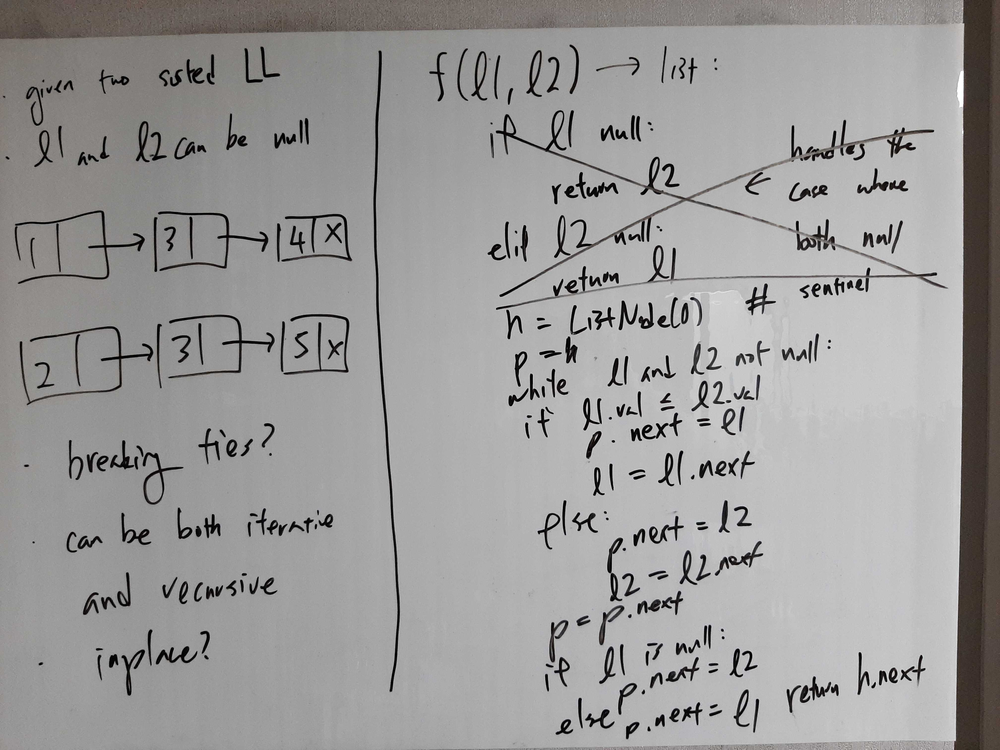
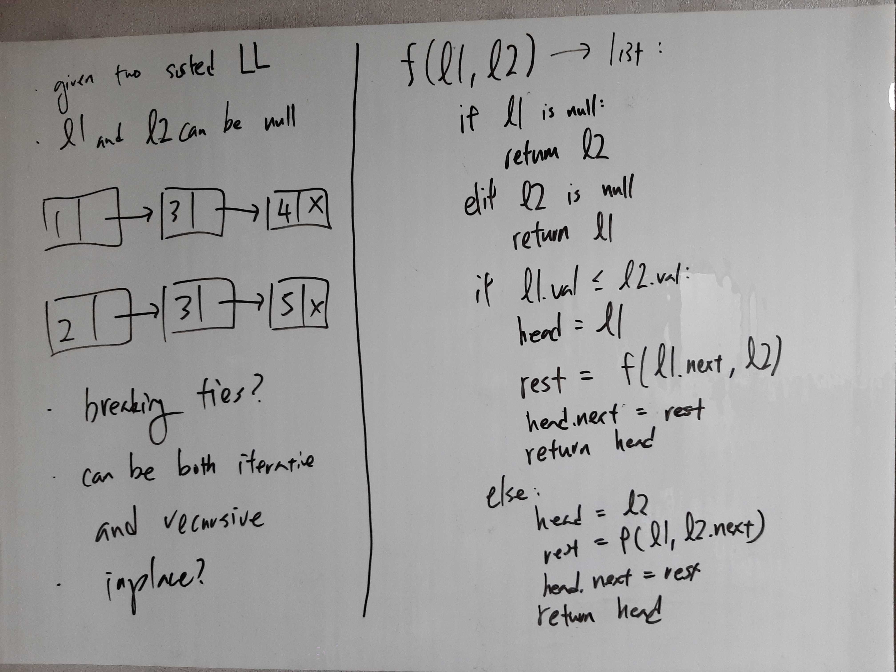

[Problem](https://leetcode.com/problems/merge-two-sorted-lists/)

## takeaway
- The iterative solution required the use of a "pre-head", which is
  interesting.

## take 1
- Iterative

- code:
```python
def merge_two_lists(self, l1: ListNode, l2: ListNode) -> ListNode:
    dummy_head = ListNode()
    p = dummy_head
    while l1 and l2:
        if l1.val <= l2.val:
            p.next = l1
            l1 = l1.next
        else:
            p.next = l2
            l2 = l2.next
        p = p.next
    if l1:
        p.next = l1
    else:
        p.next = l2
    return dummy_head.next
```
- Result
    - Accepted
- Note
    - Time: O(M + N)
    - Space: O(1)

## take 2
- Recursive

- code:
```python
def merge_two_lists(self, l1: ListNode, l2: ListNode) -> ListNode:
        if not l1:
            return l2
        elif not l2:
            return l1
        elif l1.val <= l2.val:
            l1.next = self.merge_two_lists(l1.next, l2)
            return l1
        else:
            l2.next = self.merge_two_lists(l1, l2.next)
            return l2
```
- Result
    - Accepted
- Note
    - Time: O(M + N)
    - Space: O(M + N)

