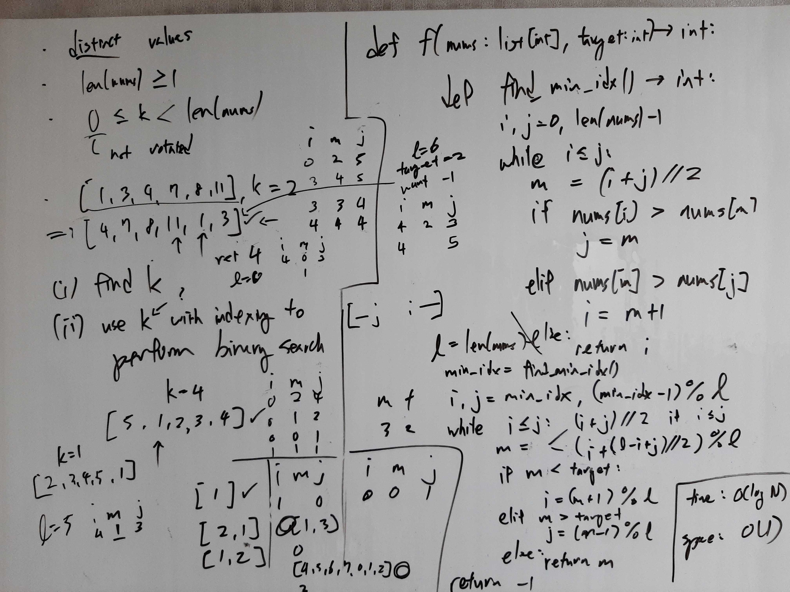

[Problem](https://leetcode.com/problems/search-in-rotated-sorted-array/)

## Algorithm Classification
- Binary Search

## Takeaways
- Avoid obnoxiously complicated indexing logic. Chances are there is a much
  easier way to do it.
- When doing binary search on rotated / shifted sorted arrays, remember that at
  least one of left and right sections is sorted, and see if you can use this
  property to solve the problem.

## Take 1
- Approach
    - Find the index at which the minimum element is located at using binary
      search.
    - Then use the found index to execute modified binary search.


- Code
```python
def search(self, nums: List[int], target: int) -> int:
    def find_min_idx() -> int:
        i, j = 0, l - 1
        while i <= j:
            m = (i + j) // 2
            if nums[i] > nums[m]:  # left not sorted
                j = m  # don't skip m, since m could be the min elem
            elif nums[m] > nums[j]:  # right not sorted
                i = m + 1  # safe to skip m
            else:  # both left and right sorted
                return i

    l = len(nums)
    min_idx = find_min_idx()
    i, j = min_idx, (min_idx - 1) % l
    while i != j:
        if i < j:
            m = (i + j) // 2
        else:
            # we want (i + (dist from 0 to j + dist from i to l) // 2) % l
            m = (i + ((j + (l - i)) // 2)) % l
        n = nums[m]
        if n < target:
            # if i == l - 1 and j == 0, then m == l - 1
            # i will be correctly updated to 0
            # setting i to m results in i staying at l - 1
            i = (m + 1) % l
        elif n > target:
            # e.g. if i == 0 and j == 1, then m == 0
            # j will be correctly  updated to 0
            # setting j to (m - 1) % l results in j staying at l - 1
            j = m
        else:  # n == target
            return m
    return i if nums[i] == target else -1
```
- Time: O(log N)
- Space: O(1)
- Result: Accepted

## Take 2
- Approach
    - Find k, instead of the index of the minimum element.
    - Now using k to modify binary search is much easier.
- Code
```python
def search(self, nums: List[int], target: int) -> int:
    def find_k() -> int:
        """
        Find the index of the minimum element
        and then return (l - min_idx) % l,
        which is equivalent to k.
        """
        i, j = 0, l - 1
        while i <= j:
            m = (i + j) // 2
            if nums[i] > nums[m]:  # left not sorted
                j = m  # don't skip m, since m could be the min elem
            elif nums[m] > nums[j]:  # right not sorted
                i = m + 1  # safe to skip m
            else:  # both left and right sorted
                return (l - i) % l

    l = len(nums)
    k = find_k()
    i, j = 0, l - 1
    while i <= j:
        m = (i + j) // 2
        rot_m = (m - k) % l
        n = nums[rot_m]
        if n < target:
            i = m + 1
        elif n > target:
            j = m - 1
        else:
            return rot_m
    return -1
```
- Time: O(log N)
- Space: O(1)
- Result: Accepted

## Take 3
- Approach
    - Can actually do it in one pass!
    - Observe that when doing binary search on the rotated array, it must be
      the case at least one of left and right is sorted.
        - if k == 0, both left and right are sorted.
        - if k <= l // 2, left is sorted, because sorted_nums[k:] starts on the
          left, where length of the sublist is greater than l // 2.
        - if k > l // 2, right is sorted, because sorted_nums[k:] starts on the
          left, where length of the sublist is less than l // 2, so it follows
          that right is sorted.
    - If left is sorted and target is in left, we can ignore right.
    - If left is sorted and target is not in left, we can ignore left.
    - If right is sorted and target is in right, we can ignore left.
    - If right is sorted and target is not in right, we can ignore right.
- Code
```python
def search(self, nums: List[int], target: int) -> int:
    i, j = 0, len(nums) - 1
    while i <= j:
        m = (i + j) // 2
        n = nums[m]
        if n == target:
            return m
        # at least one of left and right is sorted
        elif nums[i] <= n:  # left is sorted
            if nums[i] <= target and target < n:  # target in left
                j = m - 1
            else:  # target in right
                i = m + 1
        else:  # right is sorted
            if n < target and target <= nums[j]:  # target in right
                i = m + 1
            else:  # target in left
                j = m - 1
    return -1
```
- Time: O(log N)
- Space: O(1)
- Result: Accepted

