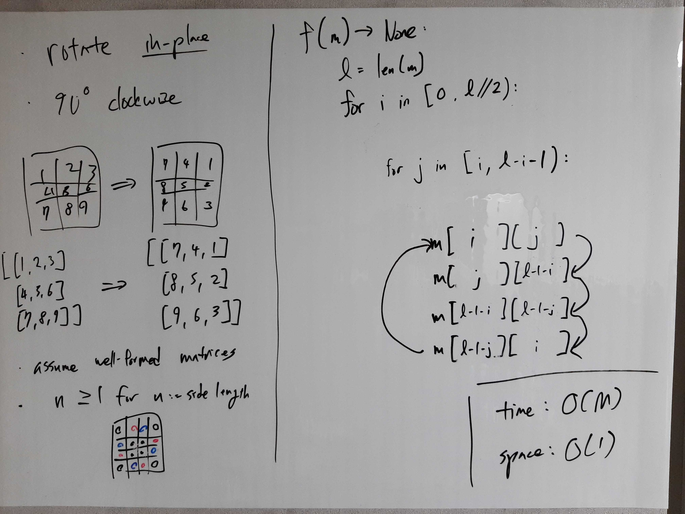

[Problem](https://leetcode.com/problems/rotate-image/)

## takeaway
- Use toy examples to guide and verifiy complicated calculations.

## take 1

- code:
```python
def rotate(self, m: list[list[int]]) -> None:
    l = len(m)
    for i in range(l // 2):
        for j in range(i, l - i - 1):
            m[i][j], m[j][l-1-i], m[l-1-i][l-1-j], m[l-1-j][i] = m[l-1-j][i], m[i][j], m[j][l-1-i], m[l-1-i][l-1-j]
```
- Result
    - Accepted

