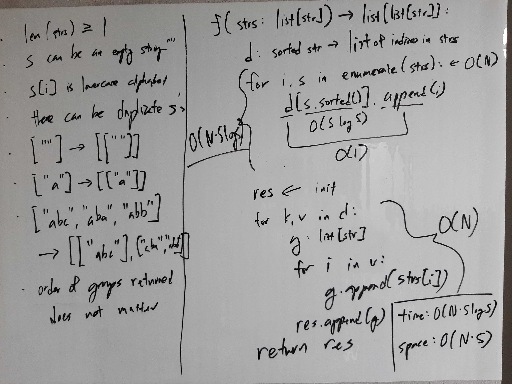
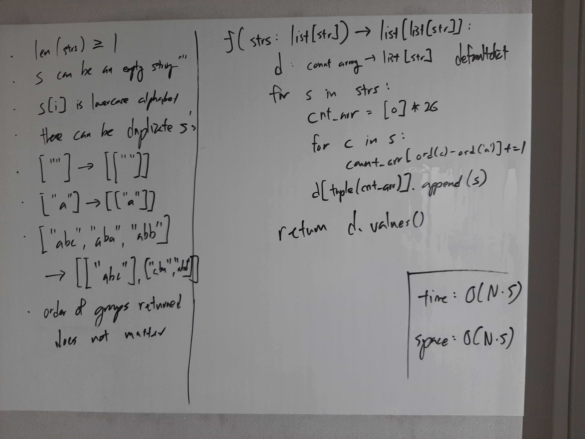

[Problem](https://leetcode.com/problems/group-anagrams/)

## takeaway
- Do not miss the opportunity to leverage on a small, fixed range of (possibly
  contiguous) key values, e.g. lowercase alphabets, to empower a simple array
  to function as a fast, ordered (easily hashable) map.
- Don't forget that dictionary keys and set elements must be hashable, where
  unordered mutable collections like maps and sets cannot be made hashable
  without sacrificing performance, i.e. using ordered variants like OrderedDict
  or TreeMap/TreeSet (Java) whose access, insertion, and deletion are O(log N).
- Use `sorted(l)` to get a sorted copy vs `l.sort()` to sort in-place.

## take 1

- code:
```python
def groupAnagrams(self, strs: List[str]) -> List[List[str]]:
    d = defaultdict(list)
    for i, s in enumerate(strs):
        d[str(sorted(s))].append(i)
    return [[strs[i] for i in v] for k, v in d.items()]
```
- Result
    - Accepted
- Note
    - Instead of appending the indices to lists, just add the strings, because
      space complexity of the dictionary is O(S * N) anyway because of the
      keys.

## take 2
- code:
```python
def groupAnagrams(self, strs: List[str]) -> List[List[str]]:
    d = defaultdict(list)
    for s in strs:
        d[tuple(sorted(s))].append(s)
    return d.values()
```
- Result
    - Accepted
- Note
    - Much cleaner than take 1.

## take 3

- code:
```python
def groupAnagrams(self, strs: List[str]) -> List[List[str]]:
    d = defaultdict(list)
    for s in strs:
        cnt_arr = [0] * 26
        for c in s:
            cnt_arr[ord(c) - ord('a')] += 1
        d[tuple(cnt_arr)].append(s)
    return d.values()
```
- Result
    - Accepted

