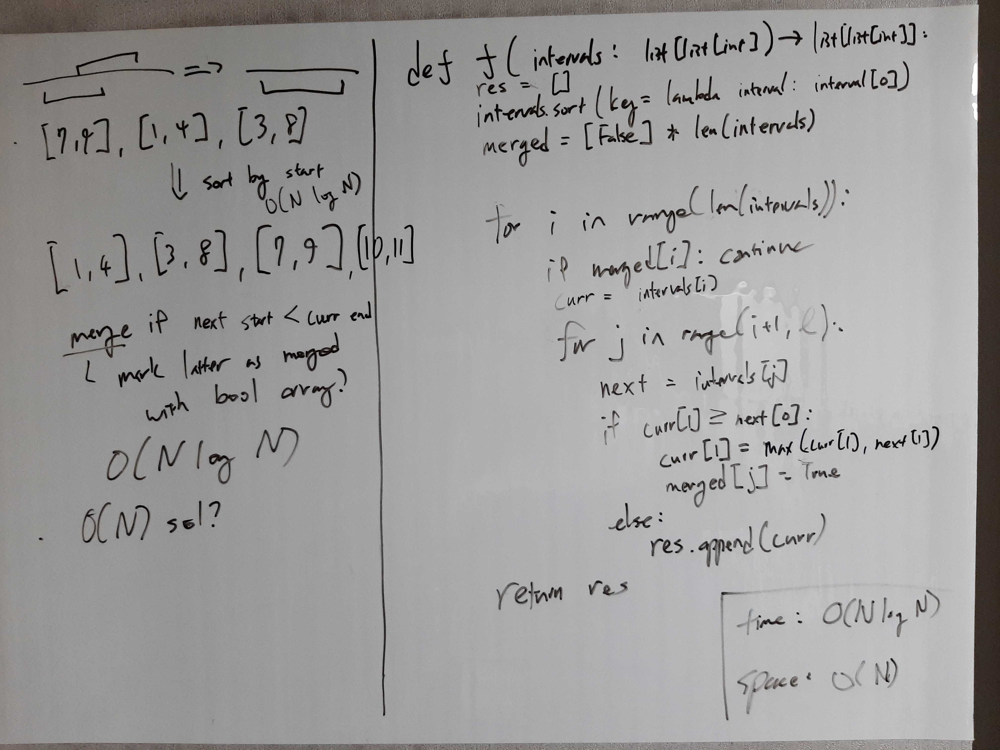

[Problem](https://leetcode.com/problems/merge-intervals/)

## takeaway
- Sorting can manipulate data to be processed more efficiently.
- Always consider sorting when there is no obvious solution below O(N^2).

## take 1

- code:
```python
def merge(self, intervals: List[List[int]]) -> List[List[int]]:
    res = []
    intervals.sort(key=lambda interval: interval[0])  # sort by start
    l = len(intervals)
    merged = [False] * l
    for i in range(l):
        if merged[i]:
            continue
        curr = intervals[i]
        for j in range(i + 1, l):
            next_ = intervals[j]
            if curr[1] >= next_[0]:
                curr[1] = max(curr[1], next_[1])
                merged[j] = True
            else:
                break
        res.append(curr)
    return res
```
- Time: O(N log N)
    - O(N log N) for sorting.
    - O(N) for initializing `merged`.
    - O(N) for scanning and merging.
- Space: O(N)
    - O(N) for sorting (Timsort).
    - O(N) for `merged`.
- Result: Accepted
- Note
    - Do we really need `merged`?

## take 2
- code:
```python
def merge(self, intervals: List[List[int]]) -> List[List[int]]:
    intervals.sort(key=lambda interval: interval[0])
    res = [intervals[0]]
    for curr in itertools.islice(intervals, 1, None):
        prev = res[-1]
        if prev[1] >= curr[0]:
            prev[1] = max(prev[1], curr[1])
        else:
            res.append(curr)
    return res
```
- Time: O(N log N)
    - O(N log N) for sorting.
    - O(N) for scanning and merging.
- Space: O(N)
    - O(N) for sorting (Timsort).
- Result: Accepted
- Note
    - Much faster than take 1 due to constant factors.

