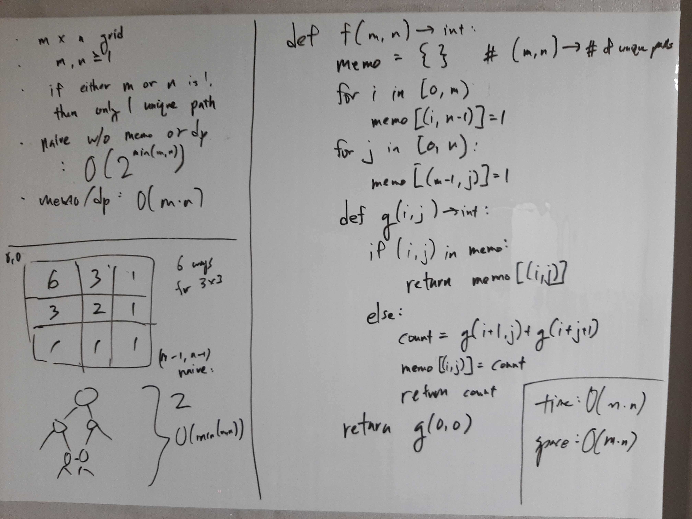
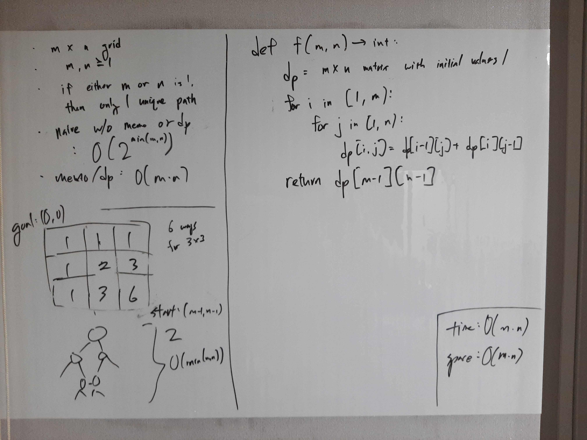

[Problem](https://leetcode.com/problems/unique-paths/)

## takeaway
- Tabulation (bottom up) and memoization (top down) are the same in essence.

## take 1
- top down memoization DP

- code:
```python
def uniquePaths(self, m: int, n: int) -> int:
    def helper(i: int, j: int) -> int:
        if (i, j) in memo:
            return memo[(i, j)]
        else:
            count = helper(i + 1, j) + helper(i, j + 1)
            memo[(i, j)] = count
            return count
    memo = {}
    for i in range(m):
        memo[(i, n - 1)] = 1
    for j in range(n):
        memo[(m - 1, j)] = 1
    return helper(0, 0)
```
- Result
    - Accepted

## take 2
- bottom up tabulation DP

- code:
```python
def uniquePaths(self, m: int, n: int) -> int:
    dp = [[1] * n for _ in range(m)]
    for i in range(1, m):
        for j in range(1, n):
            dp[i][j] = dp[i - 1][j] + dp[i][j - 1]
    return dp[m - 1][n - 1]
```
- Result
    - Accepted

