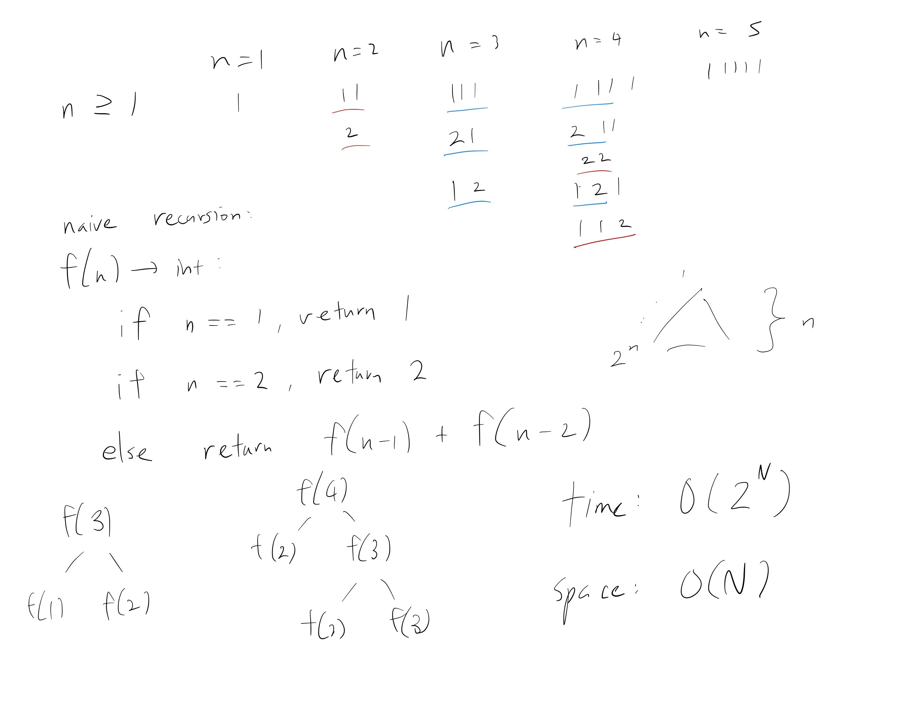
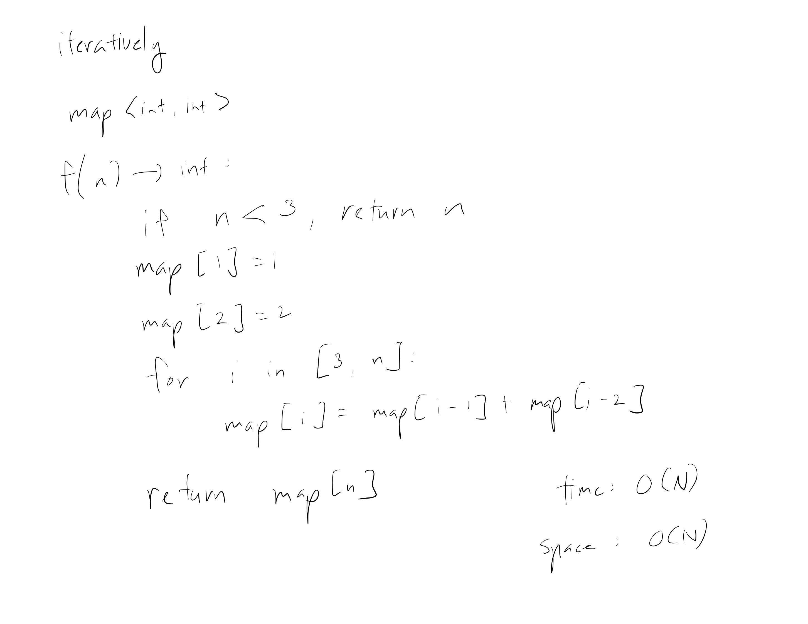
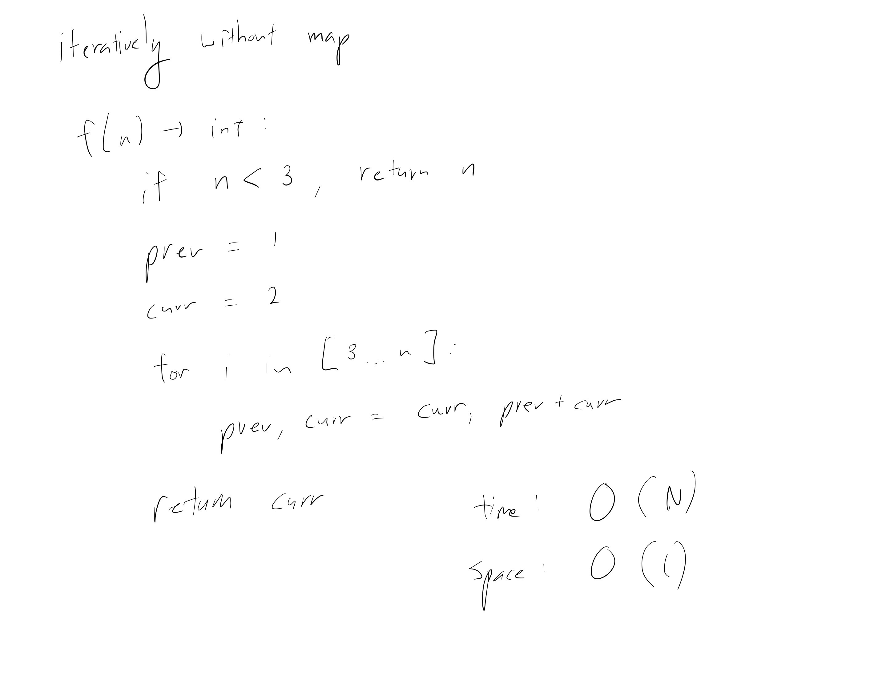

[Problem](https://leetcode.com/problems/climbing-stairs/)

## takeaway
- DP problems can be solved both recursively and iteratively.
- Naive recursion can be improved significantly by memoization.

## take 1

- code:
```java
public int climbStairs(int n) {
    if (n == 1) {
        return 1;
    } else if (n == 2) {
        return 2;
    } else {
        return climbStairs(n - 1) + climbStairs(n - 2);
    }
}
```
- Result
    - Time Limit Exceeded
- Note
    - TLE was expected

## take 2

- code:
```java
public Map<Integer, Integer> map = new HashMap<>();

public int climbStairs(int n) {
    if (n == 1) {
        return 1;
    } else if (n == 2) {
        return 2;
    } else if (map.containsKey(n)) {
        return map.get(n);
    } else {
        int result = climbStairs(n - 1) + climbStairs(n - 2);
        map.put(n, result);
        return result;
    }
}
```
- Result
    - Accepted
- Note
    - an array could replace a map, because int index, for constant speed up
    - a map could be initialized inside `climbStairs()` and passed off to a
      separate helper function

## take 3

- code:
```java
public Map<Integer, Integer> map = new HashMap<>();

public int climbStairs(int n) {
    if (n < 3) {
        return n;
    } else {
        map.put(1, 1);
        map.put(2, 2);
        for (int i = 3; i <= n; i++) {
            map.put(i, map.get(i - 1) + map.get(i - 2));
        }
        return map.get(n);
    }
}
```
- Result
    - Accepted
- Note
    - again, map could be replaced by array
    - no space complexity improvement from switching to iteration because of
      the map

## take 4

- code:
```java
public int climbStairs(int n) {
    if (n < 3) {
        return n;
    }
    int prev = 1;
    int curr = 2;
    for (int i = 3; i <= n; i++) {
        int tmp = curr;
        curr = prev + curr;
        prev = tmp;
    }
    return curr;
}
```
- Result
    - Accepted

## take 5
- code:
```python
def climb_stairs(self, n: int) -> int:
    if n < 3:
        return n
    prev = 1
    curr = 2
    for i in range(3, n + 1): # inclusive
        prev, curr = curr, prev + curr
    return curr
```
- Result
    - Accepted

