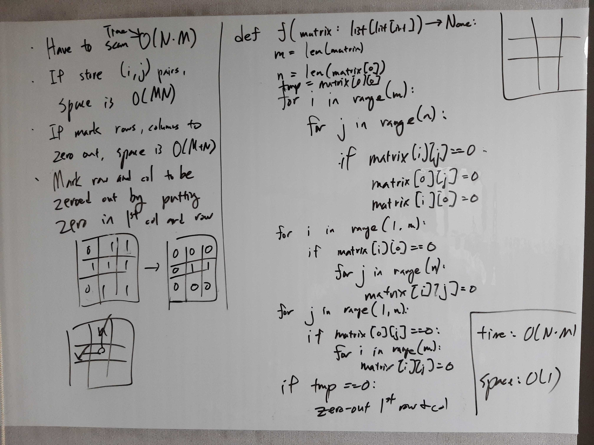

[Problem](https://leetcode.com/problems/set-matrix-zeroes/)

## takeaway
- Look for ways to encode information efficiently.
    - e.g. in this problem, 0 in the first row or col encodes that the
      corresponding row or col is to be zeroed out.

## take 1

- code:
```python
def setZeroes(self, matrix: List[List[int]]) -> None:
    m = len(matrix)
    n = len(matrix[0])

    # determine whether first row and col have to be
    # zeroed out before overwriting them with marks
    row0_zero = not all(matrix[0])
    col0_zero = not all(matrix[i][0] for i in range(m))

    # mark rows and cols to be zeroed out
    for i in range(1, m):
        for j in range(1, n):
            if matrix[i][j] == 0:
                matrix[0][j] = 0
                matrix[i][0] = 0

    # zero out non-first rows and cols
    for i in range(1, m):
        if matrix[i][0] == 0:
            for j in range(n):
                matrix[i][j] = 0
    for j in range(1, n):
        if matrix[0][j] == 0:
            for i in range(m):
                matrix[i][j] = 0

    # zero out first row and col if need be
    if row0_zero:
        for j in range(n):
            matrix[0][j] = 0
    if col0_zero:
        for i in range(m):
            matrix[i][0] = 0
```
- Time
    - O(MN)
- Space
    - O(1), excluding the input matrix.
- Result
    - Accepted

