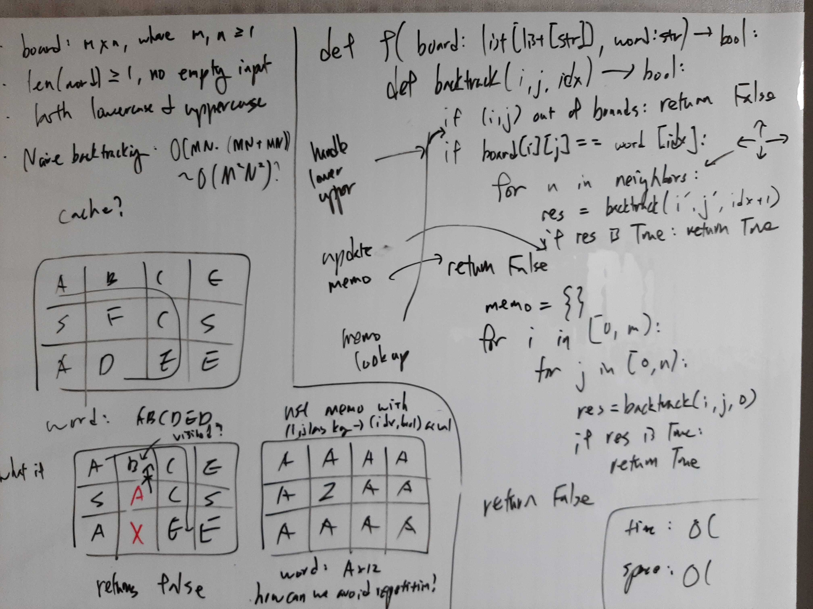

[Problem](https://leetcode.com/problems/word-search/)

## Algorithm Classification
- Backtracking

## Takeaways
- Graph search, visited sets, and path vs destination.
    - Does path matter, e.g. are A -> B -> C and A -> C different?
        - If yes, node C must be removed from the visited set, because if it
          remains in the visited set, the traversal A -> C will not be made.
        - If no, there is no need to remove C from the visited set.
- `directions` tuple is useful for graphs represented by matrices.

## Take 1
- Approach
    - Use `directions` to navigate the matrix as a graph.
    - Standard backtracking + memoization.
    - However, memoization is incorrect, as will be shown in Take 2.


- Code
```python
def exist(self, board: List[List[str]], word: str) -> bool:
    def backtrack(i: int, j: int, idx: int) -> bool:
        if i < 0 or i >= m or j < 0 or j >= n:
            return False
        if (i, j, idx) in memo:
            return False
        if (i, j) in visited:
            return False
        if board[i][j] == word[idx]:
            if idx == last:
                return True
            for d in directions:
                visited.add((i, j))
                res = backtrack(i + d[0], j + d[1], idx + 1)
                visited.remove((i, j))
                if res:
                    return True
        memo[(i, j, idx)] = False
        return False

    m = len(board)
    n = len(board[0])
    last = len(word) - 1
    directions = ((-1, 0), (0, 1), (1, 0), (0, -1))  # N, E, S, W
    memo = {}

    for i in range(m):
        for j in range(n):
            visited = set()
            res = backtrack(i, j, 0)
            if res:
                return True
    return False
```
- Result: Wrong Answer

## Take 2
- Approach
    - It is incorrect to use memo as in Take 1, because the starting grid can
      change whether board[i][j] can form word[idx:].
        - e.g. C - A - B
                       |
                       A
        - search for ABAC
        - Backtracking starting from A in the first the first row fails.
        - But if B is memoized with False, backtracking starting from A in the
          second row will incorrectly fail.

- Code
```python
def exist(self, board: List[List[str]], word: str) -> bool:
    def backtrack(i: int, j: int, idx: int) -> bool:
        if i < 0 or i >= m or j < 0 or j >= n:
            return False
        if (i, j) in visited:
            return False
        visited.add((i, j))
        if board[i][j] == word[idx]:
            if idx == last:
                return True
            for d in directions:
                if backtrack(i + d[0], j + d[1], idx + 1):
                    return True
        visited.remove((i, j))
        return False

    m = len(board)
    n = len(board[0])
    last = len(word) - 1
    directions = ((-1, 0), (0, 1), (1, 0), (0, -1))  # N, E, S, W

    for i in range(m):
        for j in range(n):
            visited = set()
            if backtrack(i, j, 0):
                return True
    return False
```
- Time: O(MN\*3^S)
    - O(MN) grids.
    - Branching factor ~ 3 excluding the "parent" grid.
    - DFS depth is O(S), where S := the length of word.
- Space: O(S)
    - DFS depth is O(S), where S := the length of word.
- Result: Accepted

