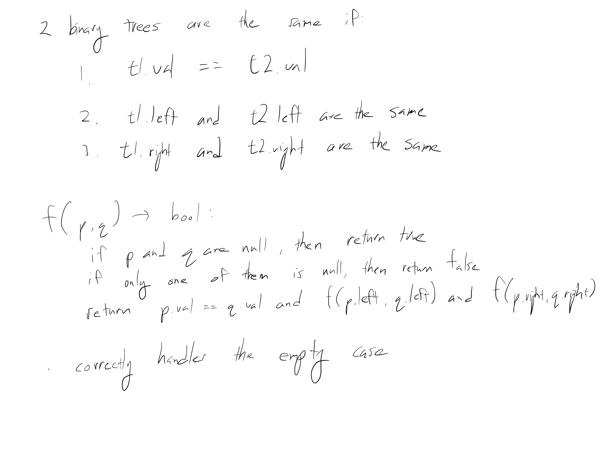

[Problem](https://leetcode.com/problems/same-tree/)

## takeaway
- Not much...

## take 1

- submission:
```java
public boolean isSameTree(TreeNode p, TreeNode q) {
    if (p == null && q == null) {
        return true;
    } else if (p == null || q == null) {
        return false;
    } else {
        return p.val == q.val
            && isSameTree(p.left, q.left)
            && isSameTree(p.right, q.right);
    }
}
```
- Time
    - O(V), where V is the minimum of the number of nodes of p and q, because
      at least V nodes have to be visited
- Space
    - average: O(log V), because the depth of a balanced binary tree is
      logarithmic w.r.t. the number of nodes, and therefore O(log V) stack
      frames are used in recursion
    - worst: O(V), because we have a linked list in the worst case
- Result
    - Accepted

## take 2
- code
```python
def is_same_tree(self, p: TreeNode, q: TreeNode):
    if not p and not q:
        return True
    elif not p or not q:
        return False
    else:
        return (p.val == q.val
                and self.is_same_tree(p.left, q.left)
                and self.is_same_tree(p.right, q.right)
```
- Result
    - Accepted

