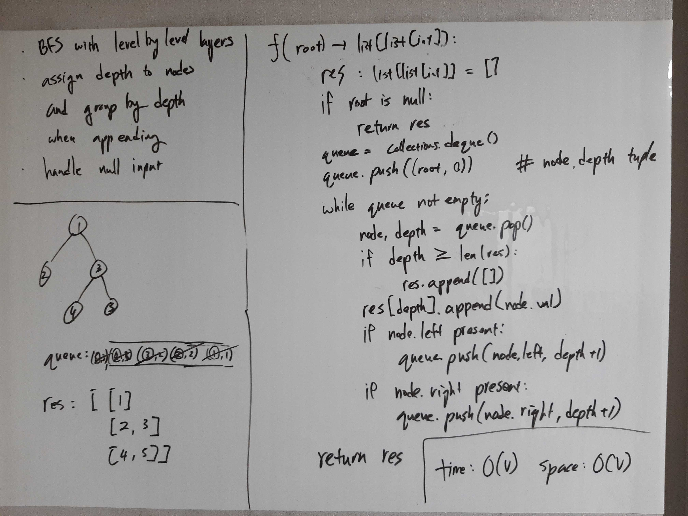

[Problem](https://leetcode.com/problems/binary-tree-level-order-traversal/)

## takeaway
- Be ready to adjust standard algorithms to solve problems with little tweaks.

## take 1

- code:
```python
def levelOrder(self, root: TreeNode) -> List[List[int]]:
    res = []
    if not root:
        return res
    queue = collections.deque()
    queue.appendleft((root, 0))  # (node, depth) tuple
    while queue:
        node, depth = queue.pop()
        if depth >= len(res):
            res.append([])
        res[depth].append(node.val)
        if node.left:
            queue.appendleft((node.left, depth + 1))
        if node.right:
            queue.appendleft((node.right, depth + 1))
    return res
```
- Result
    - Accepted

