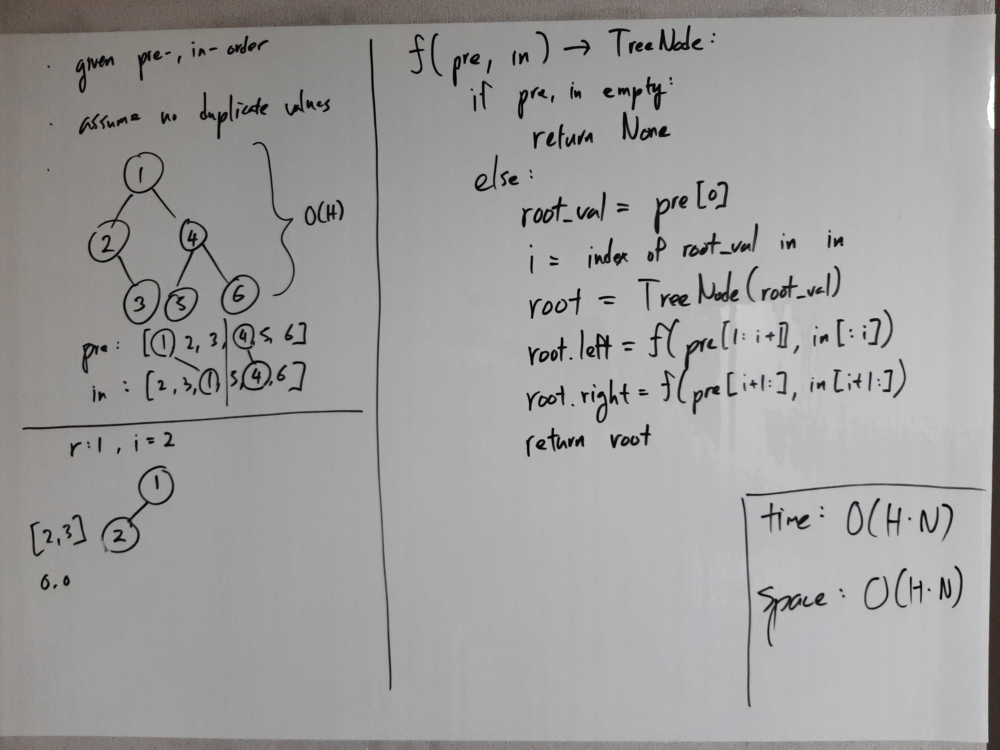
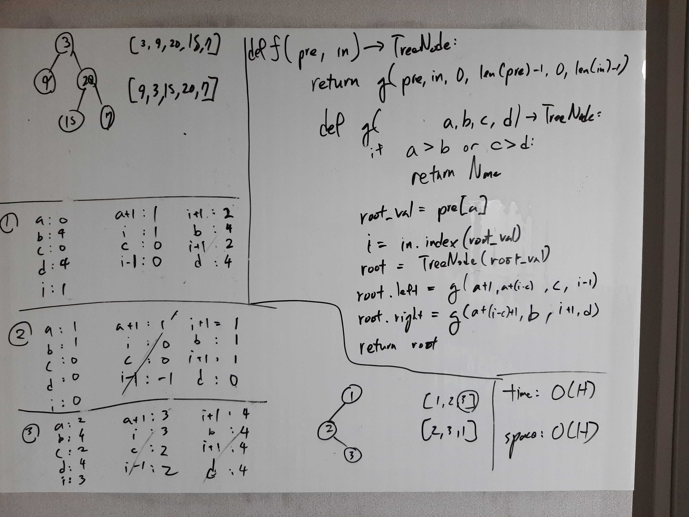

[Problem](https://leetcode.com/problems/construct-binary-tree-from-preorder-and-inorder-traversal/)

## takeaway
- Be prepared to implement more efficient, albeit more complicated solutions.

## take 1

- code:
```python
def buildTree(self, preorder: List[int], inorder: List[int]) -> TreeNode:
    if not preorder:  # assume len(preorder) == len(inorder)
        return None
    root_val = preorder[0]
    i = inorder.index(root_val)
    return TreeNode(root_val,
            self.buildTree(preorder[1:i + 1], inorder[:i]),
            self.buildTree(preorder[i + 1:], inorder[i + 1:]))
```
- Result
    - Accepted
- Note
    - Slicing is expensive though...

## take 2

- code:
```python
def buildTree(self, preorder: List[int], inorder: List[int]) -> TreeNode:
    def helper(a, b, c, d) -> TreeNode:
        if a > b or c > d:
            return None
        root_val = preorder[a]
        i = inorder.index(root_val)
        return TreeNode(root_val,
                helper(a + 1, a + (i - c), c, i - 1),
                helper(a + (i - c) + 1, b, i + 1, d))

    l = len(preorder) - 1  # assume len(preorder) == len(inorder)
    return helper(0, l, 0, l)
```
- Result
    - Accepted
- Note
    - Much better performance, but much harder to implement.

