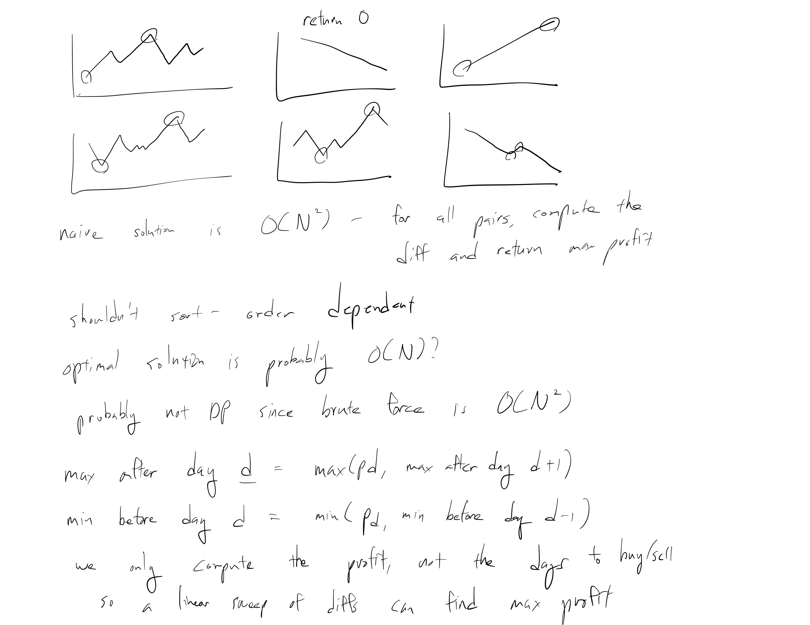
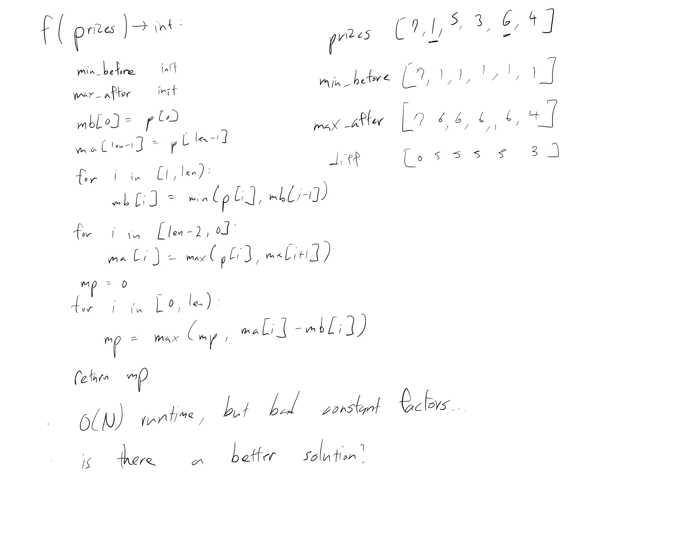
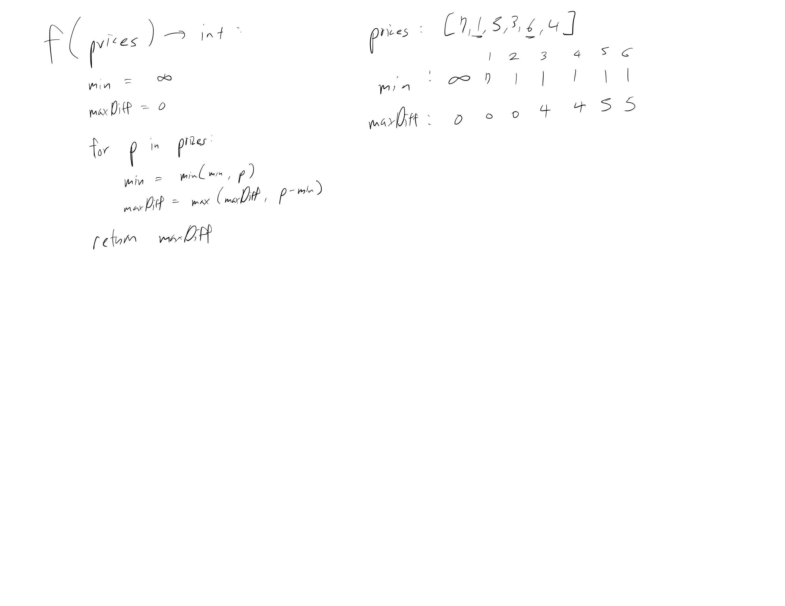

[Problem](https://leetcode.com/problems/best-time-to-buy-and-sell-stock/)

## takeaway
- Pay attention to how the information from the subproblem can be used to solve
  the problem.

## take 1


- submission:
```java
public int maxProfit(int[] prices) {
    int len = prices.length;
    int[] minBefore = new int[len];
    minBefore[0] = prices[0];
    int[] maxAfter = new int[len];
    maxAfter[len - 1] = prices[len - 1];
    for (int i = 1; i < len; i++) {
        minBefore[i] = Math.min(prices[i], minBefore[i - 1]);
    }
    for (int i = len - 2; i >= 0; i--) {
        maxAfter[i] = Math.max(prices[i], maxAfter[i + 1]);
    }
    int maxProfit = 0;
    for (int i = 0; i < len; i++) {
        maxProfit = Math.max(maxProfit, maxAfter[i] - minBefore[i]);
    }
    return maxProfit;
}
```
- Time
    - O(N)
- Space
    - O(N)
- Result
    - bad constant factor in time complexity and space inefficient...
    - there must be a better solution

## take 2

- submission:
```java
public int maxProfit(int[] prices) {
    int min = Integer.MAX_VALUE;
    int maxProfit = 0;
    for (int p : prices) {
        min = Math.min(min, p);
        maxProfit = Math.max(maxProfit, p - min);
    }
    return maxProfit;
}
```
- Time
    - O(N)
- Space
    - O(1)
- Result
    - Accepted
    - much better

## take 3
- code
```python
def max_profit(self, prices: list[int]):
    _min = float('inf')
    res = 0
    for p in prices:
        _min = min(_min, p)
        res = max(res, p - min)
    return res
```
- Result
    - Accepted

