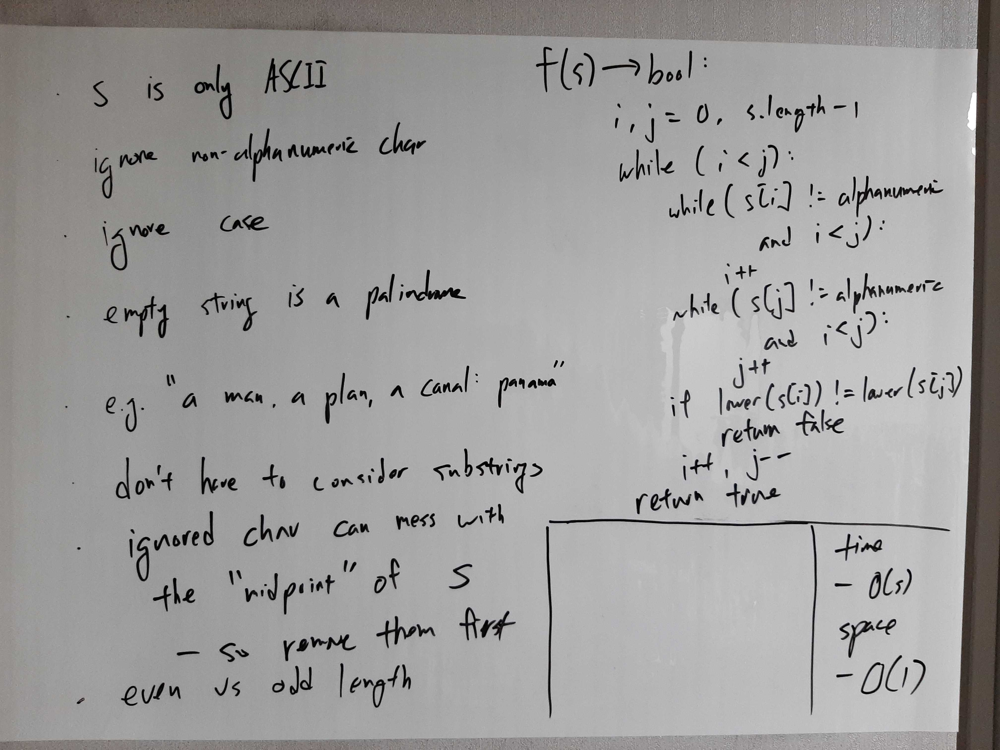

[Problem](https://leetcode.com/problems/valid-palindrome/)

## takeaway
- Do not take constant overheads lightly.

## take 1

- code:
```java
public boolean isPalindrome(String s) {
    if (s == null) {
        return false;
    }
    String s2 = "";
    for (char c : s.toCharArray()) {
        if (Character.isDigit(c)) {
            s2 += c;
        } else if (Character.isAlphabetic(c)) {
            if (Character.isUpperCase(c)) {
                c = Character.toLowerCase(c);
            }
            s2 += c;
        }
    }
    for (int i = 0; i < s2.length() / 2; i++) {
        if (s2.charAt(i) != s2.charAt(s2.length() - 1 - i)) {
            return false;
        }
    }
    return true;
}
```
- Result
    - Accepted
- Note
    - but very slow due to constant overheads
    - also space complexity is not O(1) but O(S) because of the addition string
    - furthermore, string concatenation is slow as well

## take 2

- code:
```java
public boolean isPalindrome(String s) {
    if (s == null) {
        return false;
    }
    int i = 0;
    int j = s.length() - 1;
    while (i < j) {
        if (!Character.isLetterOrDigit(s.charAt(i))) {
            i++;
            continue;
        }
        if (!Character.isLetterOrDigit(s.charAt(j))) {
            j--;
            continue;
        }
        if (Character.toLowerCase(s.charAt(i))
            != Character.toLowerCase(s.charAt(j))) {
            return false;
        }
        i++;
        j--;
    }
    return true;
}
```
- Result
    - Accepted

