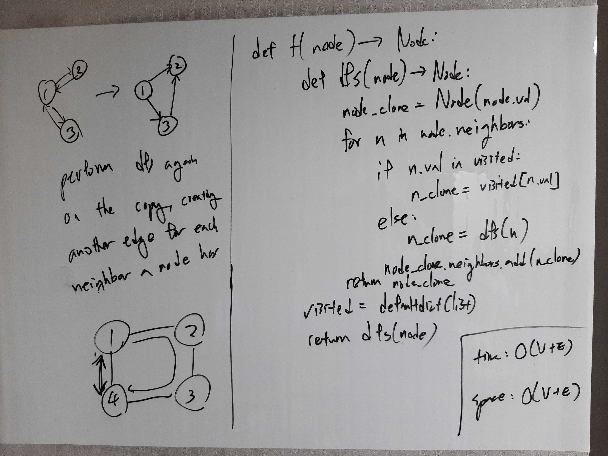

[Problem](https://leetcode.com/problems/clone-graph/)

## Algorithm Classification
- Graph
- DFS

## Takeaways
- Think about how standard algorithms can be modified and augmented to suit the
  needs of the problem.
    - e.g. a visited set can be replaced by a visited map/dictionary that
      contains references to the visited nodes.

## Take 1
- Approach
    - 1 - 2<br>
      `|   |`<br>
      4 - 3
    - dfs will visit 1-2-3-4 and terminate.
    - Need to connect 1 and 4
    - We can augmented the visited set to not just indicate whether a node has
      been visited, but also contain the reference to the node.
    - Then if a node has been visited, we can access the node by reference and
      add edges as desired.


- Code
```python
def cloneGraph(self, node: 'Node') -> 'Node':
    def dfs(node: Node) -> Node:
        node_clone = Node(node.val)
        visited[node_clone.val] = node_clone
        for n in node.neighbors:
            if n.val in visited:
                n_clone = visited[n.val]
            else:
                n_clone = dfs(n)
            node_clone.neighbors.append(n_clone)
        return node_clone

    if not node:
        return None
    visited = {}
    return dfs(node)
```
- Time: O(V + E)
    - graph traversal takes O(V + E).
    - dictionary insertion / lookup is O(1).
    - list appending is O(1).
- Space: O(V)
    - O(V) for the visited dictionary.
    - O(H) for recursion where O(H) is O(V) in the case of a linked list.
- Result: Accepted

