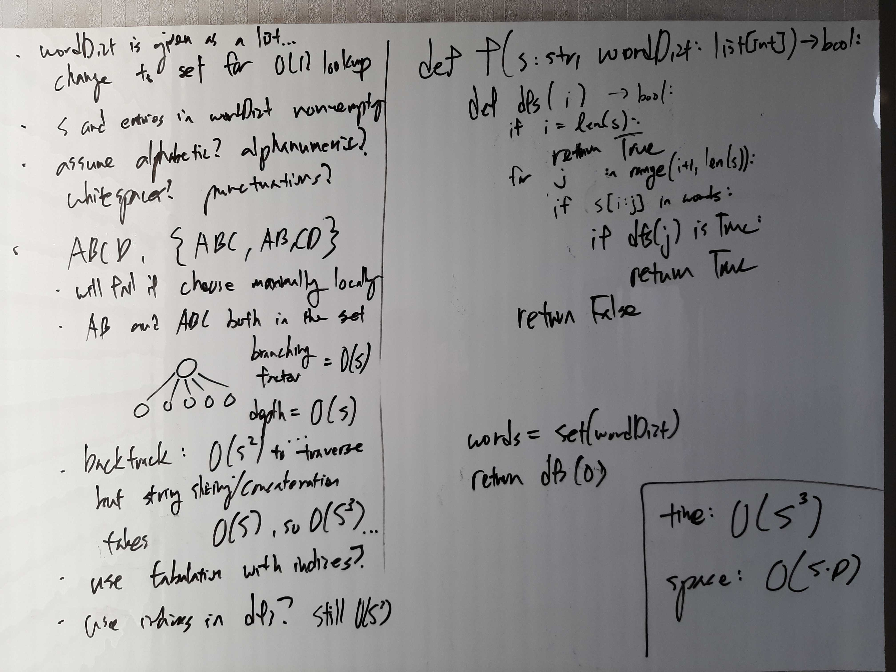
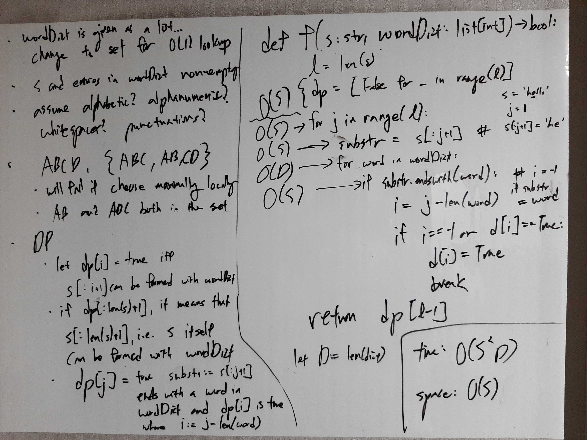

[Problem](https://leetcode.com/problems/word-break/)

## takeaway
- Always consider whether a tree search leads to a logically equivalent node,
    - e.g. 'A' + 'BC' and 'AB' + 'C' is equivalent for this problem
- If it does, avoid redundancy with memoization, or approach bottom-up with DP.
- Always define clear, simple subproblems.
    - e.g. dp[i] is true if s[:i + 1] can be formed with words in wordDict.
    - e.g.
        - memo[i] is true if s[i:] can be formed with words in wordDict
        - memo[i] is false if s[i:] cannot be formed with words in wordDcit
        - if i not in memo, we do not yet know.
- Differentiate None vs False in boolean DP, where None encodes that the answer
  to the subproblem is unknown, whereas False encodes that the answer to the
  subproblem is determined to be false.
    - However, in a bottup-up tabulation approach, if we know that subproblems
      will be visited in a deterministic, sequential fashion, dp[j] can be
      initialized as False for j > i, where i is the step we're at.
    - But in Python, if the above were the case, it's better off to just append
      to the dp list as we go, because there is no need to initialize a fixed
      size array.
- Top-down = memoization, bottom-up = tabulation. Don't mix top-down with
  tabulation or bottom-up with memoization.

## take 1
- Naive backtracking

- code:
```python
def wordBreak(self, s: str, wordDict: List[str]) -> bool:
    def dfs(i: int) -> bool:
        if i == l:
            return True
        else:
            return any(dfs(j) if s[i:j] in wordSet else False for j in range(i + 1, l + 1))

    l = len(s)
    wordSet = set(wordDict)
    return dfs(0)
```
- Time: O(2^S)
    - For string s of length S, there are S - 1 ways to partition the string
      into two non-empty substrings, e.g. ABC -> (A, BC), (AB, C), where for
      each S substrings of length S - i for 1 <= i < S, there are S - i - 1
      ways to split the substring. Then it follows that:
        - Base case: T(2) = 1
        - T(S) = T(S - 1) + (S - 2) + ... + T(2)
        - T(S - 1) = T(S - 2) + ... + T(2)
        - T(S) - T(S - 1) = T(S - 1)
        - T(S) = 2 * T(S - 1)
        - T(S) = 2 * 2 * ... * T(2)
        - T(S) = O(2^S)
- Space: O(S)
    - Recursion depth can go upto O(S).
- Result: Time Limit Exceeded

## take 2
- bottom-up tabulation DP

- code:
```python
def wordBreak(self, s: str, wordDict: List[str]) -> bool:
    l = len(s)
    # dp[i] is true if s[:i + 1] can be formed with words in wordDict
    dp = [False for _ in range(l)]
    for j in range(l):
        substr = s[:j + 1]
        for word in wordDict:
            if substr.endswith(word):
                i = j - len(word)
                # if j == -1, substr == word
                if i == -1 or dp[i] == True:
                    dp[j] = True
                    break
    return dp[l - 1]
```
- Time: O(S^2\*D)
    - Let D be the size of `wordDict`.
    - O(S\*D) loop with O(S) work (endswith) each.
  Space: O(S)
    - O(S) for the dp array.
- Result: Accepted

## take 3
- top-down memoization DP with DFS
```python
def wordBreak(self, s: str, wordDict: List[str]) -> bool:
    def dfs(i: int) -> bool:
        if i == len(s):
            return True
        elif i in memo:
            return memo[i]
        else:
            substr = s[i:]
            memo[i] = any(substr.startswith(word) and dfs(i + len(word)) for word in wordDict)
            return memo[i]

    # memo[i] is true if s[i:] can be formed with words in wordDict
    # memo[i] is false if s[i:] cannot be formed with words in wordDcit
    # if i not in memo, we do not yet know if s[i:] can be formed with words in wordDict
    memo = {}
    return dfs(0)
```
- Time: O(S^2\*D)
    - Let D be the size of `wordDict`.
    - O(S) recursion depth with O(D) branching factor.
    - O(S) work for each recursive step (startswith)
- Space: O(S)
    - O(S) for the max recursion depth.
- Result: Accepted

