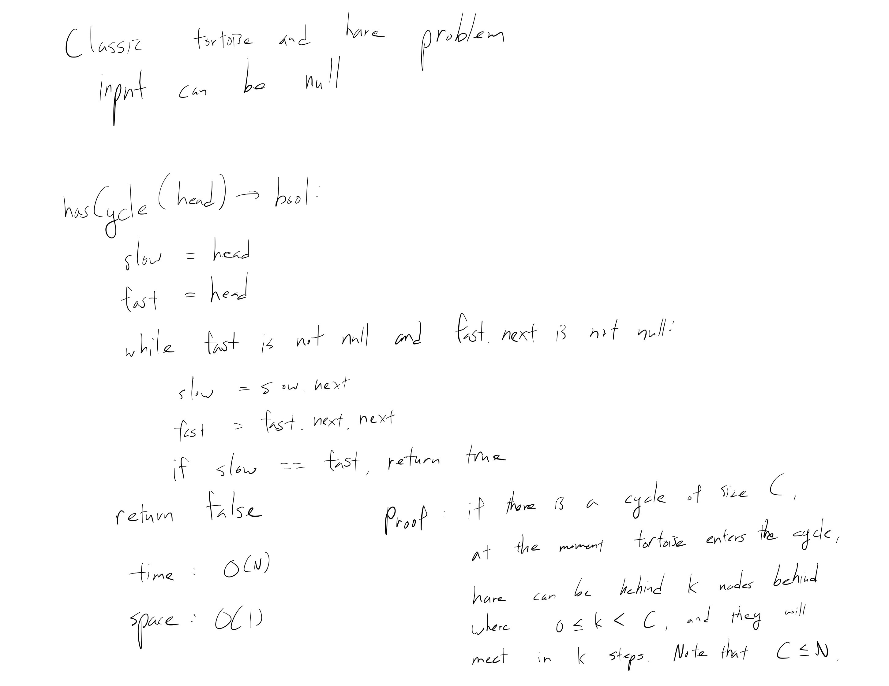

[Problem](https://leetcode.com/problems/linked-list-cycle/)

## takeaway
- Floyd's cycle detection algorithm.

## take 1

- code:
```java
public boolean hasCycle(ListNode head) {
    ListNode tortoise = head;
    ListNode hare = head;
    while (hare != null && hare.next != null) {
        tortoise = tortoise.next;
        hare = hare.next.next;
        if (tortoise == hare) {
            return true;
        }
    }
    return false;
}
```
- Result
    - Accepted

## take 2
- Python version
- code:
```python
def hasCycle(self, head: ListNode) -> bool:
    slow, fast = head, head
    while fast and fast.next:
        slow = slow.next
        fast = fast.next.next
        if slow is fast:
            return True
    return False
```
- Time
    - O(N)
- Space
    - O(1)
- Result
    - Accepted

