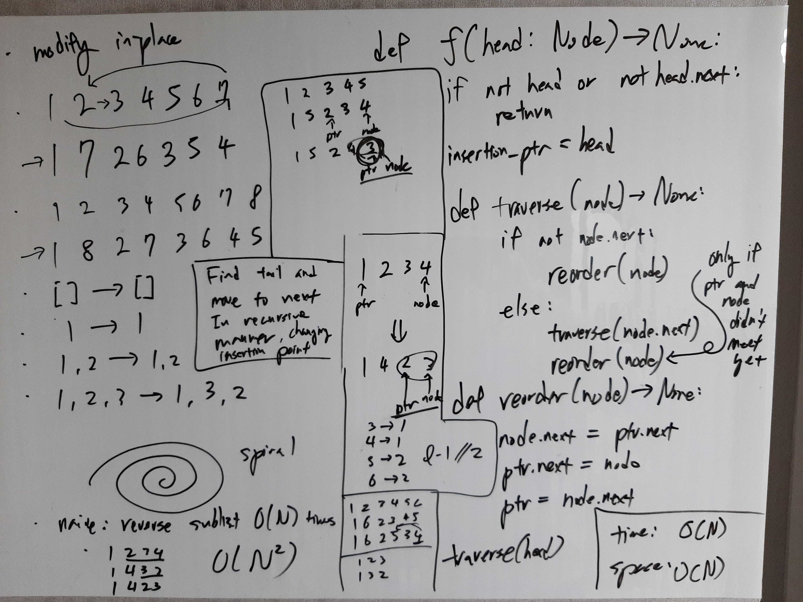

[Problem](https://leetcode.com/problems/reorder-list/)

## Algorithm Classification
- Linked List

## Takeaways
- Consider if a problem can be divided into simpler procedural subproblems.

## Take 1
- Approach
    - Reorder using recursion with nonlocal variables, updating the pointer at
      which reordering happens.


- Code
```python
def reorderList(self, head: ListNode) -> None:
    def helper(node) -> None:
        nonlocal ptr, done
        if node.next:  # traverse until tail
            helper(node.next)
        if ptr:  # more reorderings to do
            # reorder
            node.next = ptr.next
            ptr.next = node
            # advance ptr
            ptr = ptr.next.next
            # terminate reordering
            if ptr.next is node:
                ptr.next = None
                ptr = None
            elif ptr.next.next is node:
                ptr.next.next = None
                ptr = None

    if not head:
        return
    ptr = head
    done = False
    helper(node=head)
```
- Time: O(N)
- Space: O(N)
- Result: Accepted
    - Space inefficient, and pretty slow as well...

## Take 2
- Approach
    - Divide the problem into 3 simple parts:
        1. bisect
        2. reverse the right
        3. merge

- Code
```python
def reorderList(self, head: ListNode) -> None:
    def bisect(head) -> ListNode:
        def find_length(head) -> int:
            ptr = head
            length = 0
            while ptr:
                ptr = ptr.next
                length += 1
            return length

        length = find_length(head)
        mid = length // 2

        ptr = head
        for _ in range(mid - 1):
            ptr = ptr.next
        # break link
        nxt = ptr.next
        ptr.next = None
        ptr = nxt
        return head, ptr

    def reverse(head) -> ListNode:
        ptr = head
        prev = None
        while ptr.next:
            nxt = ptr.next
            ptr.next = prev
            prev = ptr
            ptr = nxt
        ptr.next = prev
        return ptr

    def merge(l1, l2) -> None:
        while l1.next:
            nxt1 = l1.next
            nxt2 = l2.next
            l1.next = l2
            l2.next = nxt1
            l1 = nxt1
            l2 = nxt2
        l1.next = l2  # len(l1) == len(l2) or len(l1) == len(l2) + 1

    if not head or not head.next:
        return
    _, right = bisect(head)
    right = reverse(right)
    merge(head, right)
```
- Time: O(N)
- Space: O(1)
- Result: Accepted

