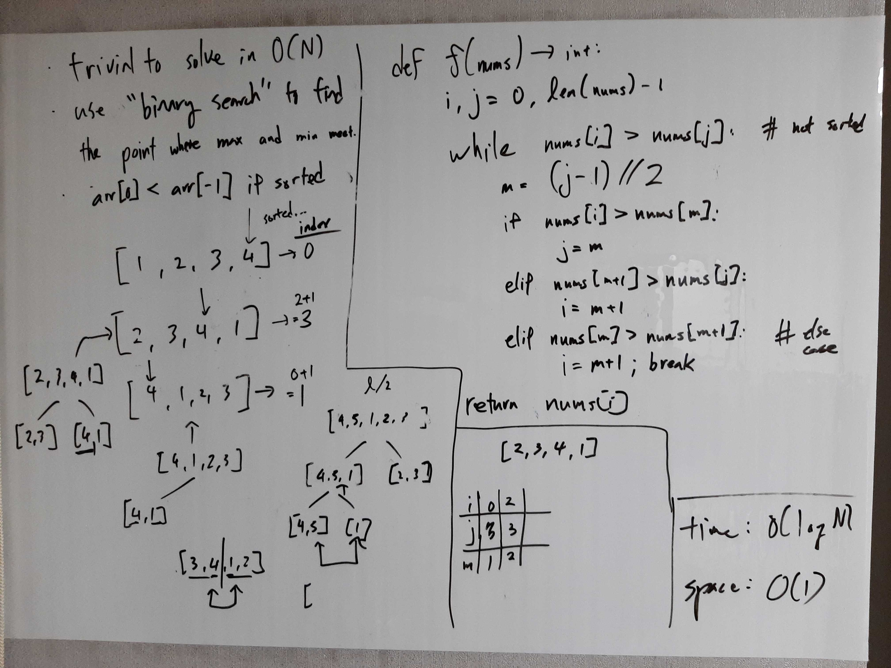

[Problem](https://leetcode.com/problems/find-minimum-in-rotated-sorted-array/)

## takeaway
- Leverage on properties of sorted (+ variations) collections for O(log N) time
  complexity.

## take 1

- code:
```python
def findMin(self, nums: List[int]) -> int:
    i, j = 0, len(nums) - 1
    while nums[i] > nums[j]:
        m = (j - i) // 2
        if nums[i] > nums[m]:
            j = m
        elif nums[m + 1] > nums[j]:
            i = m + 1
        else:
            i = m + 1
            break
    return nums[i]
```
- Time
    - O(log N)
- Space
    - O(1)
- Result
    - Accepted

