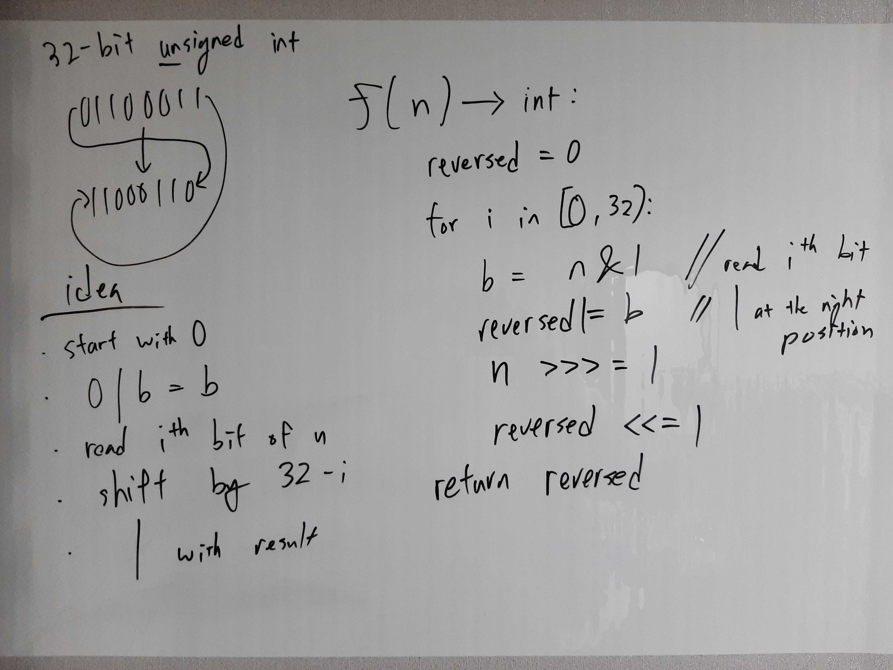

[Problem](https://leetcode.com/problems/reverse-bits/)

## takeaway
- Be careful with off-by-one error, e.g. this problem needed 31 shifts, not 32. 

## take 1

- code:
```java
public int reverseBits(int n) {
    int reversed = n & 1;
    for (int i = 0; i < 31; i++) {
        n >>>= 1; // unsigned right shift
        reversed <<= 1;
        reversed |= n & 1;
    }
    return reversed;
}
```
- Result
    - Accepted

