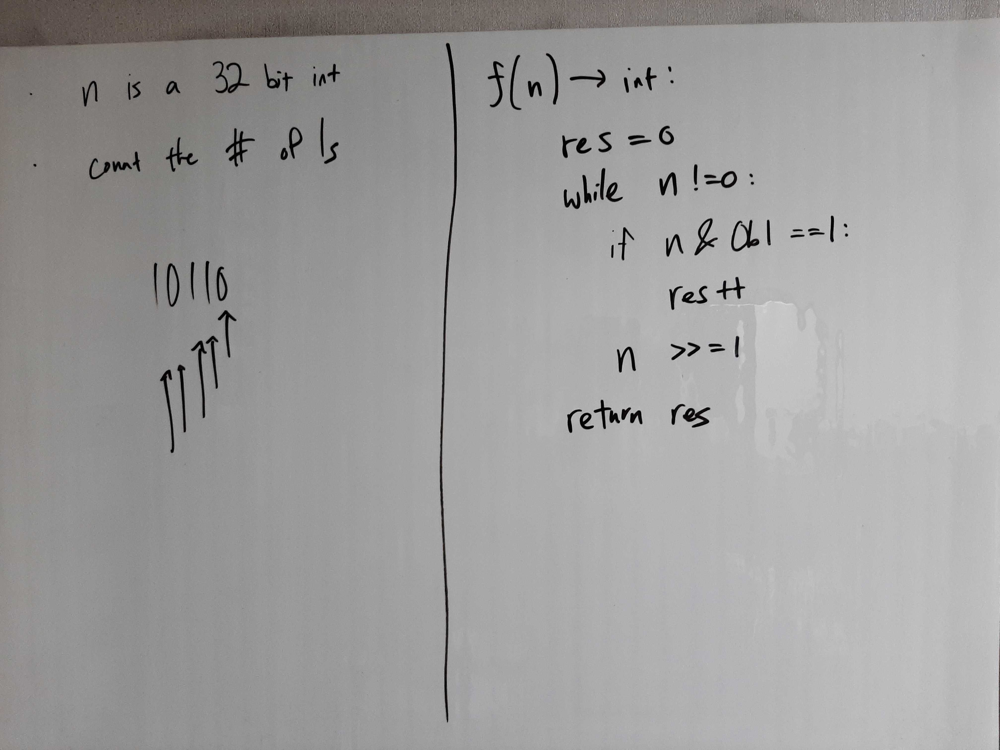
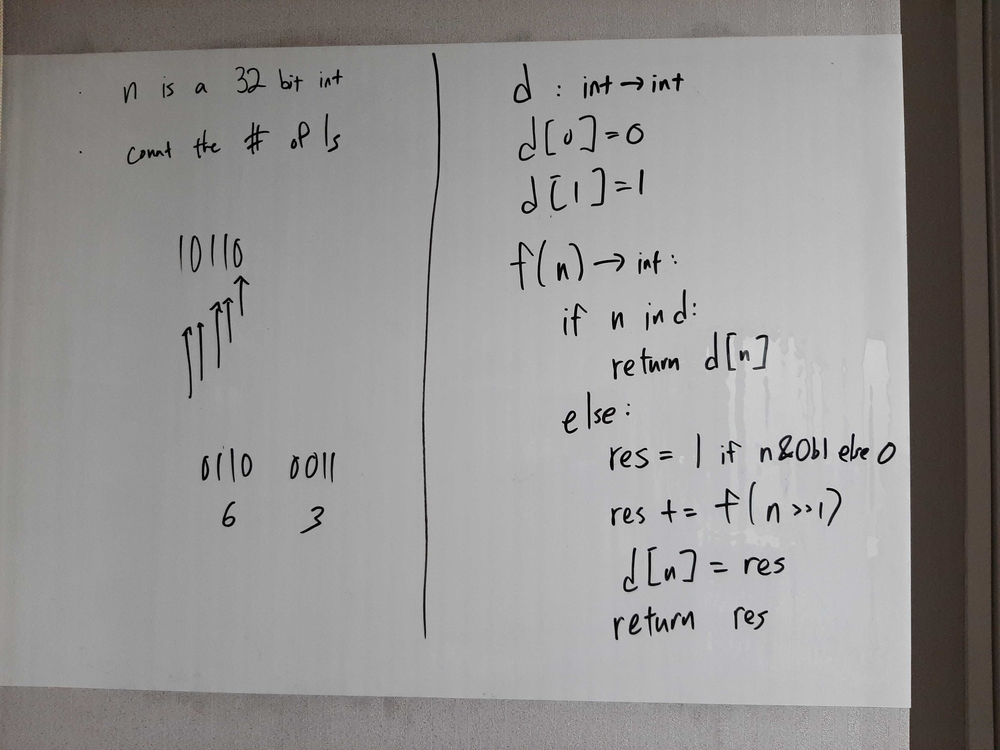

[Problem](https://leetcode.com/problems/number-of-1-bits/)

## takeaway
- Using recursion makes caching intermediate results easier.

## take 1

- code:
```python
def hamming_weight(self, n: int) -> int:
    res = 0
    while n != 0:
        if n & 0b1 == 1:
            res += 1
        n >>= 1
    return res
```
- Result
    - Accepted
- Note
    - Constant time and space complexities

## take 2
- Solution for the follow-up question

- code:
```python
d = {0: 0, 1: 1}

def hamming_weight(self, n: int) -> int:
    if n in self.d:
        return self.d[n]
    else:
        res = 1 if n & 0b1 else 0
        res += self.hamming_weight(n >> 1)
        self.d[n] = res
        return res
```
- Result
    - Accepted
- Note
    - Time: O(1)
    - Space: O(1) because the number of valid inputs is capped at 2^32

