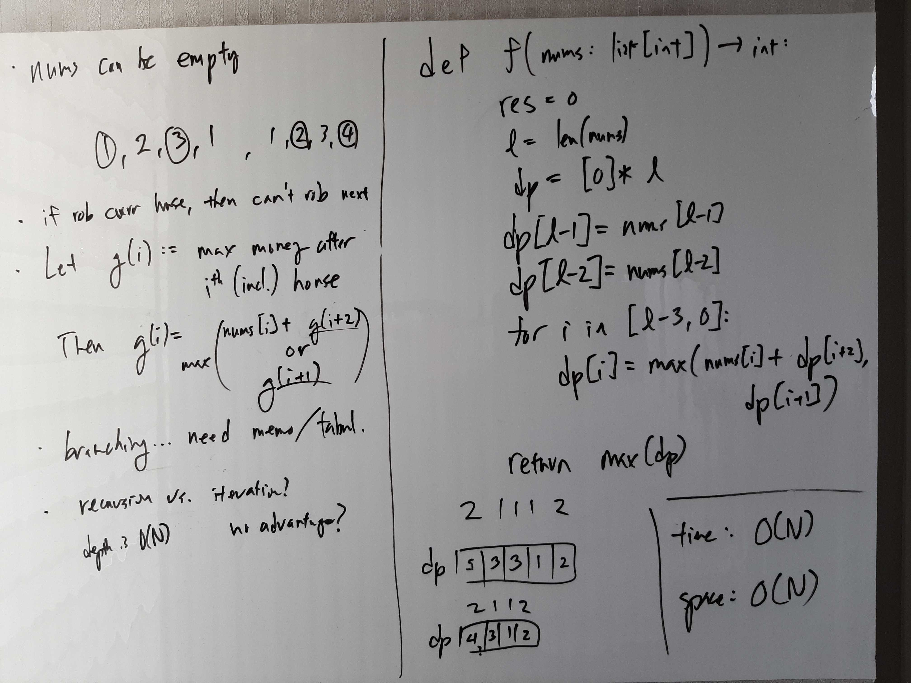
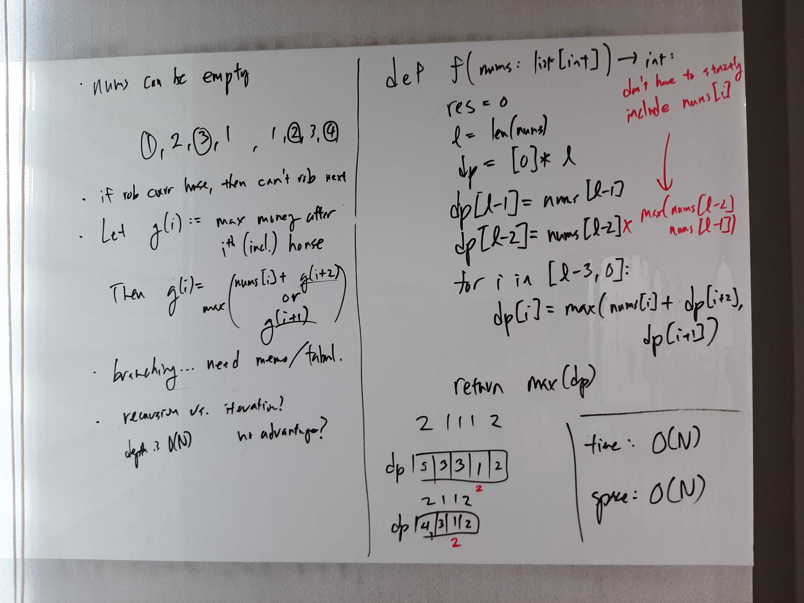

[Problem](https://leetcode.com/problems/house-robber/)

## takeaway
- Be careful with defining subproblems, e.g. does dp[i] strictly include the
  value at i or not?
- When solving DP, always look for ways to accumulate results to reduce space
  complexity.

## take 1

- code:
```python
def rob(self, nums: List[int]) -> int:
    if not nums:
        return 0
    res = 0
    l = len(nums)
    dp = [0] * l  ## dp[i] := max money after i-th (inclusive) house
    dp[l - 1] = nums[l - 1]
    dp[l - 2] = nums[l - 2]
    for i in range(l - 3, -1, -1):
        dp[i] = max(nums[i] + dp[i + 2], dp[i + 1])
    return max(dp)
```
- Time: O(N)
- Space: O(N)
- Result: Wrong Answer
- Note
    - dp[i] doesn't have to strictly include nums[i], e.g. given [..., 1,
      2], dp[-2] should be 2 not 1.

## take 2

- code:
```python
def rob(self, nums: List[int]) -> int:
    if not nums:
        return 0
    res = 0
    l = len(nums)
    dp = [0] * l  ## dp[i] := max money after i-th (inclusive) house
    dp[l - 1] = nums[l - 1]
    dp[l - 2] = max(nums[l - 2], nums[l - 1])
    for i in range(l - 3, -1, -1):
        dp[i] = max(nums[i] + dp[i + 2], dp[i + 1])
    return max(dp)
```
- Time: O(N)
- Space: O(N)
- Result: Accepted
- Note
    - We only need dp[i + 1] and dp[i + 2] to solve dp[i], so we can replace
      the dp list and with accumulator variables?

## take 3
- code:
```python
def rob(self, nums: List[int]) -> int:
    res, prev = 0, 0
    for n in nums:
        res, prev = max(res, prev + n), res
    return res
```
- Time: O(N)
- Space: O(1)
- Result: Accepted
- Note
    - It is equally valid to go forward instead of backward.
    - Since it is always true that dp[i - 2] <= dp[i - 1] and at index i - 1,
      the max result is always equal to dp[i - 1], we can just use the res
      variable to represent dp[i - 1] and just add one additional prev variable
      to track dp[i - 2].

