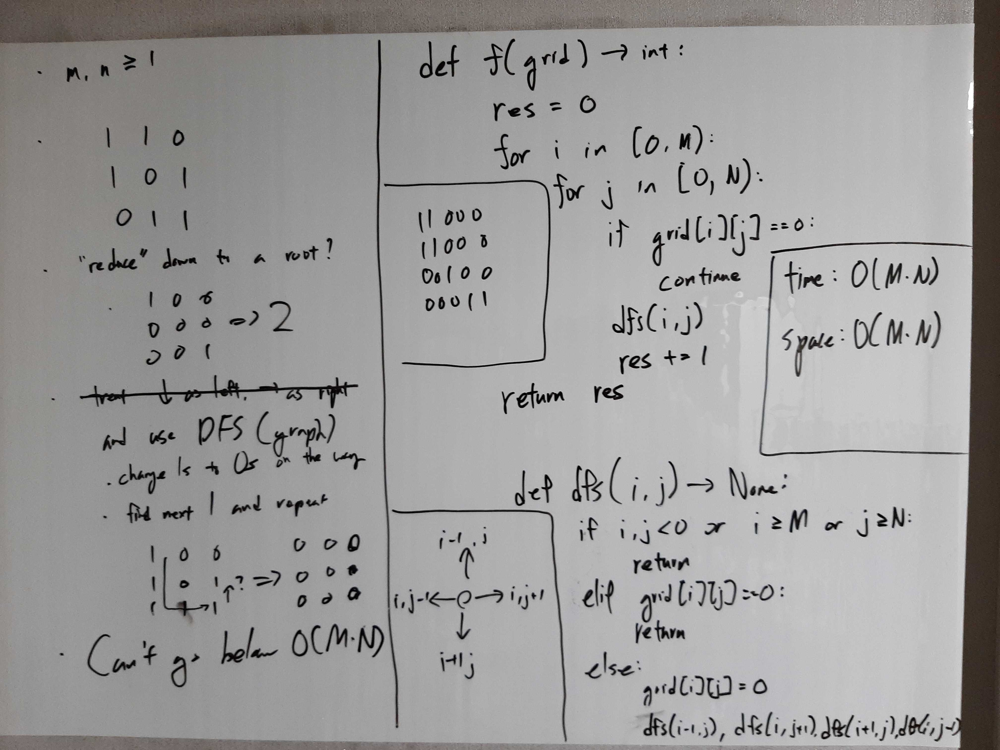

[Problem](https://leetcode.com/problems/number-of-islands/)

## takeaway
- Check conditions when executing a function, as opposed to calling a function,
  because the conditions can change between the call and the execution.
- Pay attention to the input type, e.g. 0 vs '0'.

## take 1

- code:
```python
def numIslands(self, grid: List[List[str]]) -> int:
    def dfs(i, j) -> None:
        if i < 0 or j < 0 or i >= m or j >= n:
            return
        if grid[i][j] == '0':
            return
        grid[i][j] = '0'
        dfs(i - 1, j)
        dfs(i, j + 1)
        dfs(i + 1, j)
        dfs(i, j - 1)

    res = 0
    m = len(grid)
    n = len(grid[0])
    for i in range(m):
        for j in range(n):
            if grid[i][j] == '0':
                continue
            dfs(i, j)
            res += 1
    return res
```
- Time
    - O(MN)
- Space
    - O(MN)
- Result
    - Accepted

