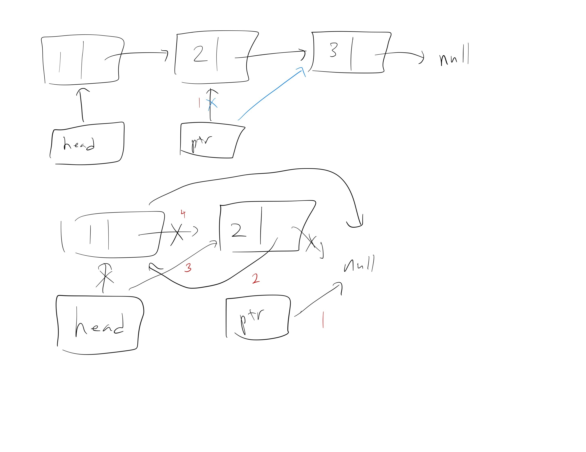
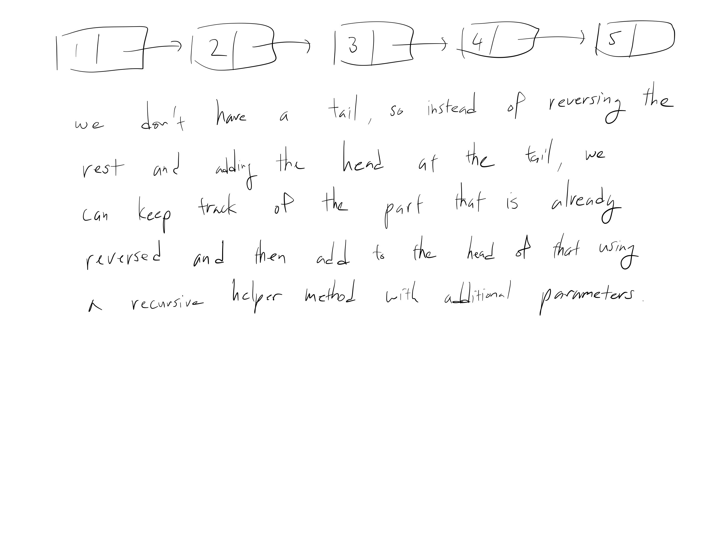
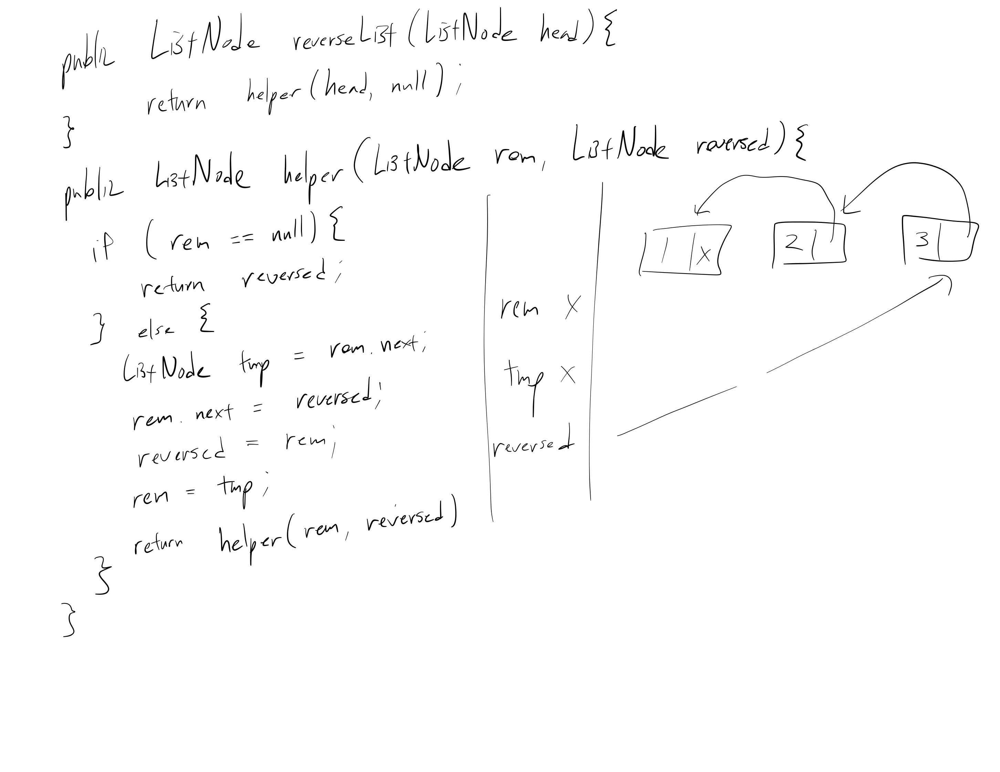
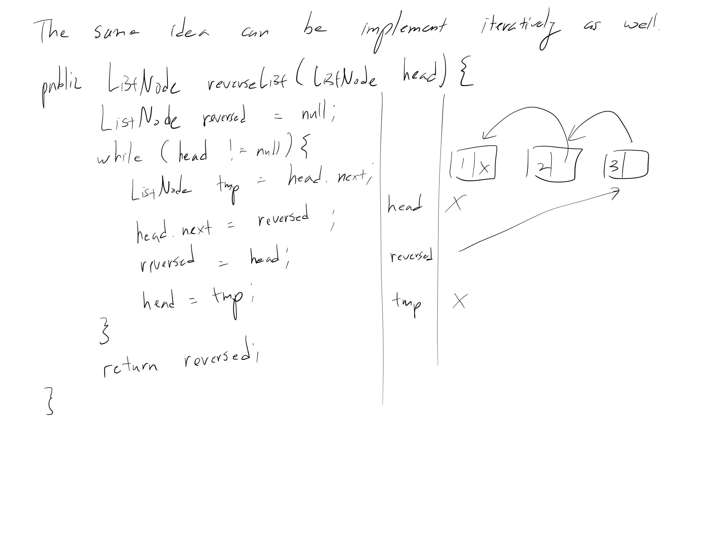

[Problem](https://leetcode.com/problems/reverse-linked-list/)

## takeaway
- Be careful when trying to divide the problem into subproblems.
- "Flipping" the problem, e.g. adding the head to the reversed list instead
  adding the tail to the reversed list, can be very powerful.
- Using a temporary pointer is often useful.




## take 1
- a goofy approach using a map
- not the "right" way to solve the problem, but just wanted to see how it turns
  out
- submission:
```java
public ListNode reverseList(ListNode head) {
    if (head == null || head.next == null) {
        return head;
    }
    Map<Integer, ListNode> map = new HashMap<>();
    int i = 0;
    while (head != null) {
        map.put(i++, head);
        head = head.next;
    }
    int j = i - 1;
    head = map.get(j);
    ListNode ptr = head;
    while (j >= 0) {
        ptr.next = map.get(j--);
        ptr = ptr.next;
    }
    ptr.next = null;
    return head;
}
```
- Time
    - O(N), since only need sweep the linked list once
- Space
    - O(N), because O(N) elements are inserted into the map
- Result
    - Accepted
    - slower than the "right" approach, as expected
    - surprisingly, less memory usage compared to 93.82% of other submissions
      despite linear space complexity, probably because a recursive approach
      require O(N) stack frames anyways

## take 2
- a recursive approach


- submission:
```java
public ListNode reverseList(ListNode head) {
    return helper(head, null);
}

public ListNode helper(ListNode remaining, ListNode reversed) {
    if (remaining == null) {
        return reversed;
    } else {
        ListNode tmp = remaining.next;
        remaining.next = reversed;
        reversed = remaining;
        remaining = tmp;
        return helper(remaining, reversed);
    }
}
```
- Time
    - O(N), since only need sweep the linked list once
- Space
    - O(N), because O(N) stack frames
- Result
    - Accepted
    - fast, as expected
    - uses more memory than the map approach
    - an iterative appoarch will likely consume less memory

## take 3
- an iterative approach

- submission:
```java
public ListNode reverseList(ListNode head) {
    ListNode reversed = null;
    while (head != null) {
        ListNode tmp = head.next;
        head.next = reversed;
        reversed = head;
        head = tmp;
    }
    return reversed;
}
```
- Time
    - O(N), since only need sweep the linked list once
- Space
    - O(1), as no recursion or additional data structure used
- Result
    - Accepted
    - fast, as expected
    - space efficient, as expected

## take 4
- code:
```python
reverse_list(self, head: ListNode):
    _reversed = None
    while head:
        tmp = head.next
        head.next = _reversed
        _reversed = head
        head = tmp
    return _reversed
```
- Result:
    - Accepted

