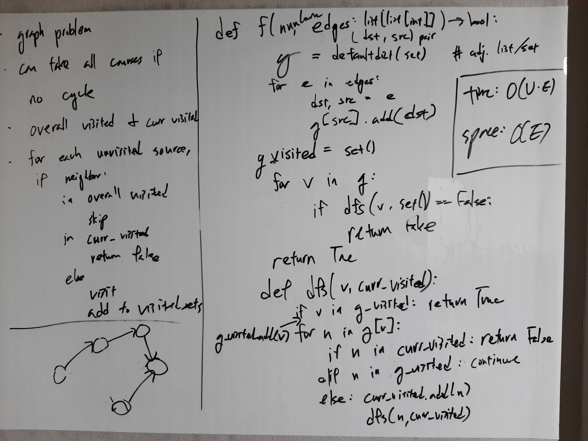

[Problem](https://leetcode.com/problems/course-schedule/)

## takeaway
- Backtracking usually searches for a single solution that satisfies a CSP, but
  it can also search for a single failure in a CSP.

## take 1

- code:
```python
def canFinish(self, numCourses: int, prerequisites: List[List[int]]) -> bool:
    def dfs(v: int, curr_visited: set[int]) -> bool:
        if v in curr_visited:  # cycle encountered
            return False
        elif v in g_visited:  # already visited; skip
            return True
        else:  # recurse
            g_visited.add(v)
            curr_visited.add(v)
            if v in g:  # v has outgoing edges
                return all(dfs(n, set(curr_visited)) for n in g[v])  # copy curr_visited
            else:  # reached a sink
                return True

    # initialize graph as adjacency list
    g = defaultdict(list)
    for e in prerequisites:
        dst, src = e
        g[src].append(dst)

    g_visited = set()  # global visited set
    return all(dfs(v, set()) for v in g.keys())
```
- Time
    - O(V * E)
    - Graph traversal takes O(V + E) where for each recursive call, we're
      making a copy of size O(V).
    - Then we get V + V * E = V(1 + E) = O(V * E)
- Space
    - O(V + E)
    - O(V) for `g_visited` and `curr_visited`.
    - O(E) for the adjacency list.
    - O(V) for recursion, because the depth of recursion can be O(V) if we
      start at a source that reaches the entire graph.
- Result
    - Accepted
- Note
    - Can we avoid the copying?

## take 2
- code:
```python
def canFinish(self, numCourses: int, prerequisites: List[List[int]]) -> bool:
    def dfs(v: int, curr_visited: set[int]) -> bool:
        if v in curr_visited:  # cycle encountered
            return False
        elif v in g_visited:  # already visited; skip
            return True
        else:  # recurse
            curr_visited.add(v)
            res = v not in g or all([dfs(n, curr_visited) for n in g[v]])
            curr_visited.remove(v)
            g_visited.add(v)
            return res

    # initialize graph as adjacency list
    g = defaultdict(list)
    for e in prerequisites:
        dst, src = e
        g[src].append(dst)

    g_visited = set()  # global visited set
    return all(dfs(v, set()) for v in g.keys())
```
- Time
    - O(V + E)
    - By removing unncessary copying, the time complexity is just that of a
      graph traversal.
- Space
    - O(V + E)
    - O(V) for `g_visited` and `curr_visited`.
    - O(E) for the adjacency list.
    - O(V) for recursion, because the depth of recursion can be O(V) if we
      start at a source that reaches the entire graph.
- Result
    - Accepted

