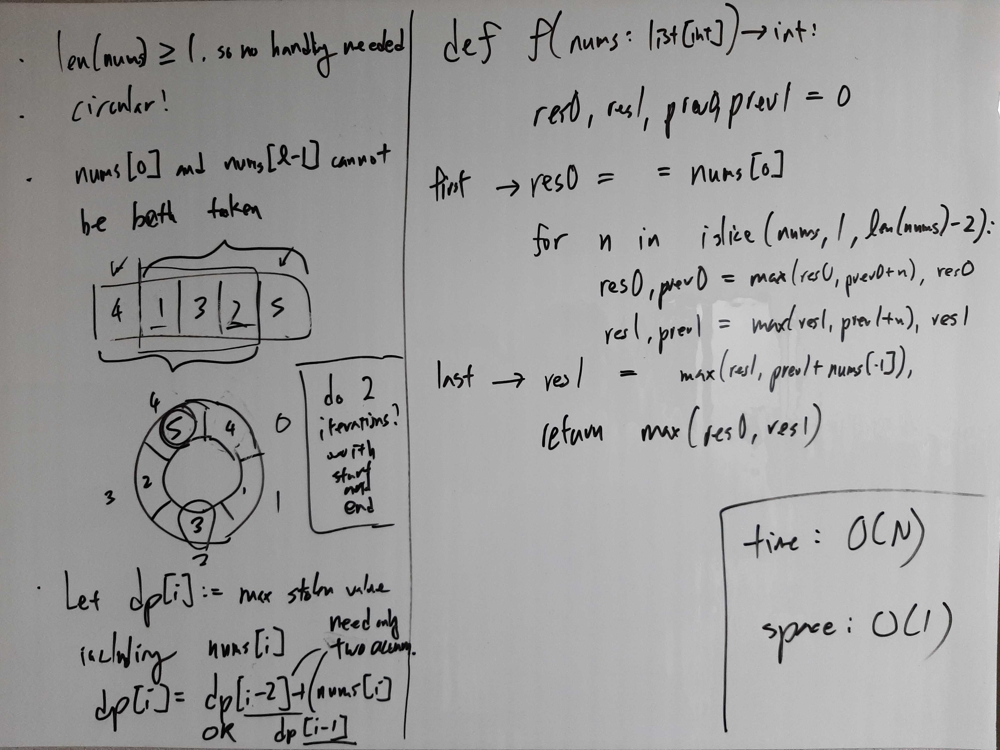

[Problem](https://leetcode.com/problems/house-robber-ii/)

## Algorithm Classification
- DP

## Takeways
- Look for ways to divide a problem into logical subproblems that can be solved
  easily and accumulate solutions to those subproblems.

## Take 1
- Approach
    - Divide the problem into stealing from houses 0 to l - 2 vs from houses 1
      to l - 1, and return the max between the two.


- Code
```python
def rob(self, nums: List[int]) -> int:
    res0, res1, prev0, prev1 = 0, 0, 0, 0

    res0 = nums[0]  # first house
    for n in islice(nums, 1, len(nums) - 1):  # houses in between
        res0, prev0 = max(res0, prev0 + n), res0
        res1, prev1 = max(res1, prev1 + n), res1
    res1 = max(res1, prev1 + nums[-1])  # last house

    return max(res0, res1)
```
- Time: O(N)
- Space: O(1)
- Result: Accepted

