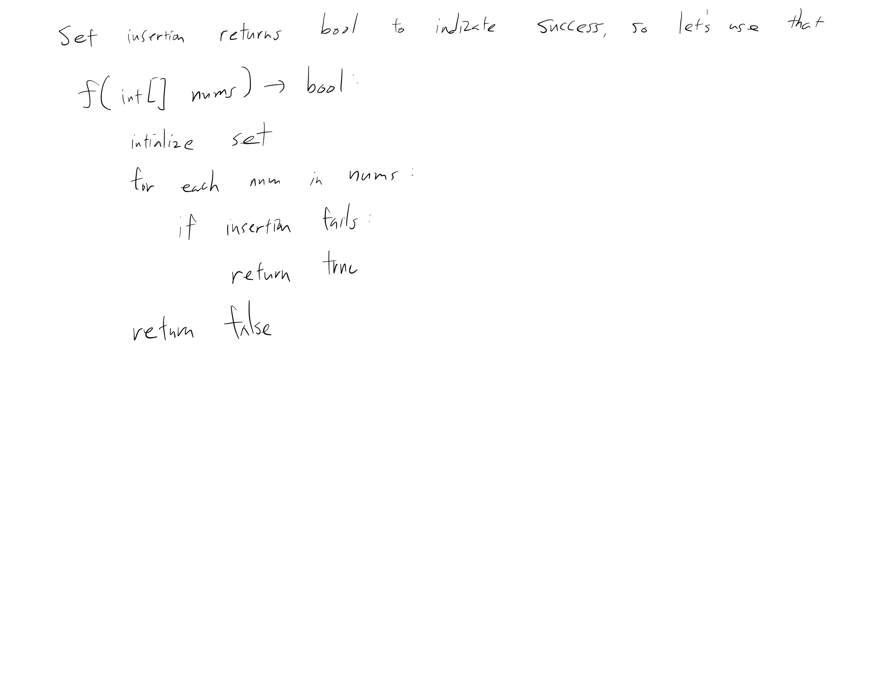

[Problem](https://leetcode.com/problems/contains-duplicate/)

## takeaway
- Not much...

## take 1
- using a set can trivialize this problem

- submission:
```java
public boolean containsDuplicate(int[] nums) {
    Set<Integer> set = new HashSet<>();
    for (int num : nums) {
        if (!set.add(num)) {
            return true;
        }
    }
    return false;
}
```
- Time
    - linear, since sweeping the array once where each insertion takes constant
      time
- Space
    - linear, since allocating a set whose size could grow up to exactly N in
      the case of no duplicate
- Result
    - Accepted
    - can be faster?

## take 2
- we want a faster LeetCode submission!
- submission:
```java
public boolean containsDuplicate(int[] nums) {
    if (nums == null || nums.length == 1) {
        return false;
    }
    int max = Integer.MIN_VALUE;
    int min = Integer.MAX_VALUE;
    for (int n : nums) {
        max = Math.max(max, n);
        min = Math.min(min, n);
    }
    int diff = max - min;
    if (diff == 0) {
        return true;
    }
    int[] arr = new int[diff + 1];
    for (int n : nums) {
        int i = n - min;
        if (arr[i] != 0) {
            return true;
        }
        arr[i]++;
    }
    return false;
}
```
- Time
    - linear, since sweeping the array twice and each operation is takes
      constant time
- Space
    - O(d), where d is the difference between the min and max elements
    - d can get quite big!
- Result
    - Accepted
    - faster than the "right" solution
    - used much more memory, as expected
    - but really, this solution is a joke xD

## take 3
- code
```python
def contains_duplicate(self, nums: list[int]) -> bool:
    s = set()
    for n in nums:
        if n in s:
            return True
        else:
            s.add(n)
    return False
```
- Result
    - Accepted

