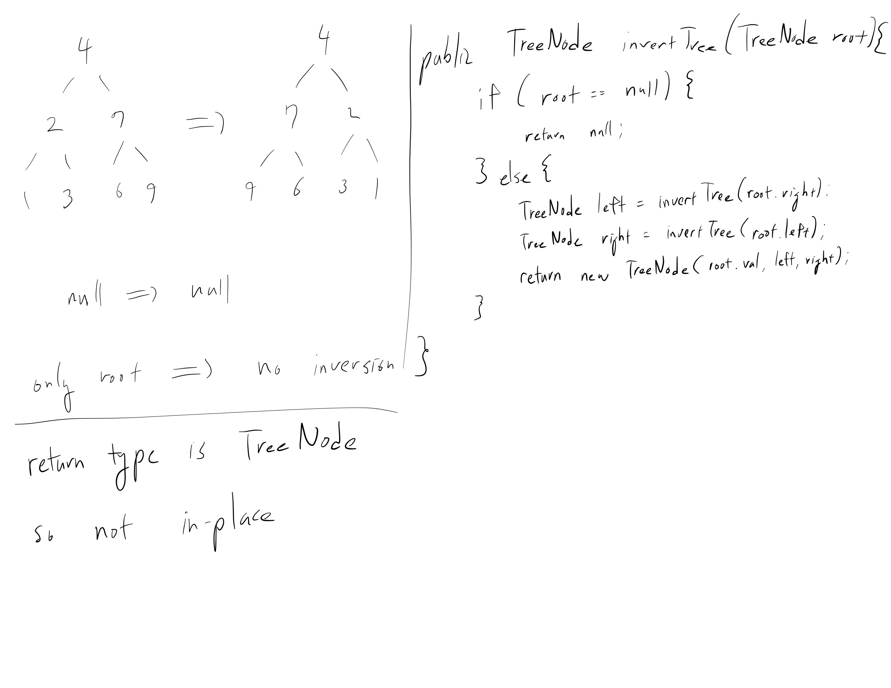

[Problem](https://leetcode.com/problems/invert-binary-tree)

## takeaway
- Not much...



## take 1
- swap left and right children
- submission:
```java
public TreeNode invertTree(TreeNode root) {
    if (root == null) {
        return null;
    } else {
        TreeNode left = invertTree(root.right);
        TreeNode right = invertTree(root.left);
        return new TreeNode(root.val, left, right);
    }
}
```
- Time
    - O(V), where V is the number of nodes, as all the nodes have to be visited
- Space
    - need space for recursion
    - average case: O(log V) if balanced
    - worst case: O(V) if linked list
- Result
    - Accepted

## take 2
- code:
```python
invert_tree(self, root: TreeNode) -> TreeNode:
    if not root:
        return None
    else:
        left = self.invert_tree(root.right)
        right = self.invert_tree(root.left)
        return TreeNode(root.val, left, right)
```
- Result:
    - Accepted

