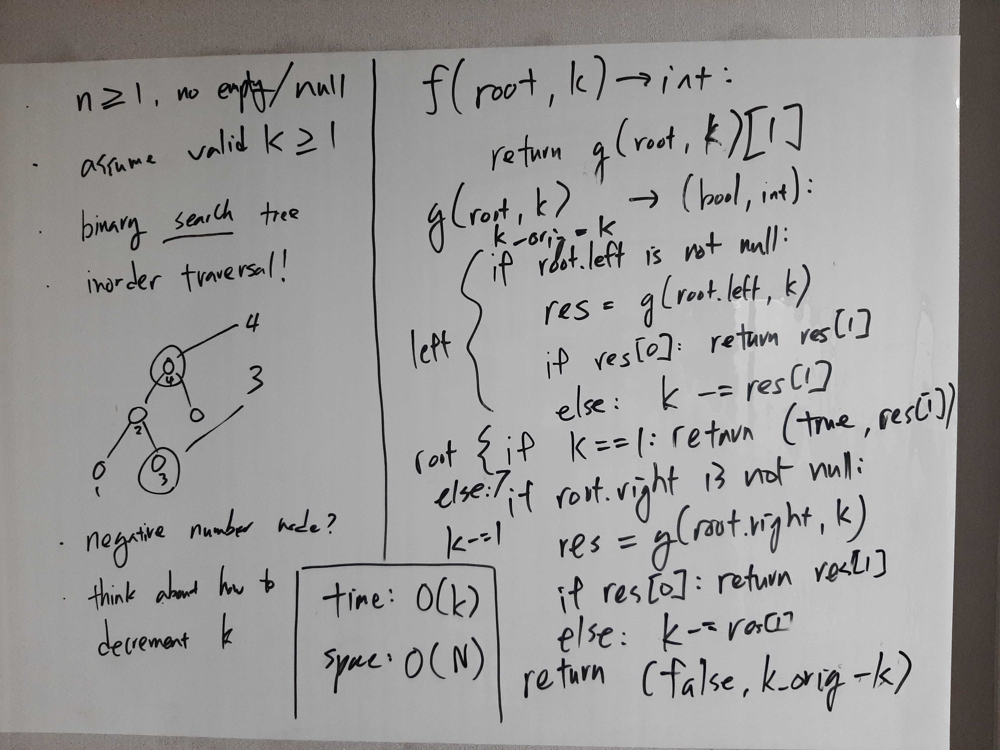
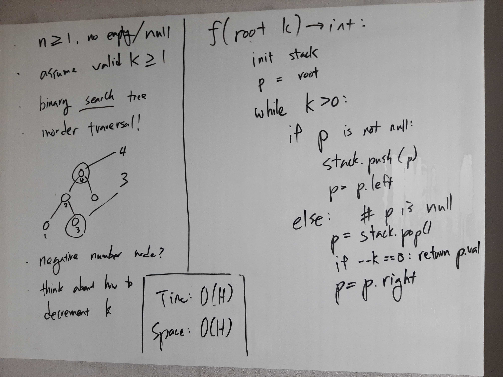

[Problem](https://leetcode.com/problems/kth-smallest-element-in-a-bst/)

## takeaway
- Making appropriate modifications to the standard approach can yield better
  time and/or space complexities.
    - e.g. take 1 reduces space complexity from O(N) to O(H).
- Familiarize yourself with iterative preorder, inorder, postorder traversals.

## take 1

- code:
```python
def kthSmallest(self, root: TreeNode, k: int) -> int:
    return self.helper(root, k)[1]

def helper(self, root: TreeNode, k: int) -> (bool, int):
    k_orig = k
    # process left
    if root.left:
        res = self.helper(root.left, k)
        if res[0]:
            return (True, res[1])
        else:
            k -= res[1]
    # process root
    if k == 1:
        return (True, root.val)
    else:
        k -= 1
    # process right
    if root.right:
        res = self.helper(root.right, k)
        if res[0]:
            return (True, res[1])
        else:
            k -= res[1]
    return (False, k_orig - k)
```
- Result
    - Accepted
- Note
    - It is significantly easier to traverse the entire BST to copy and store
      node values into a list and return the Kth element. However, that
      requires O(N) space to store the elements so I chose not to take that
      route.
    - I leveraged on Python's ability to easily return a tuple to differentiate
      whether the returned int value is the Kth smallest element or the number
      of nodes checked off. It's cute, but probably not the best way to go.

## take 2
- code:
```python
def kthSmallest(self, root: TreeNode, k: int) -> int:
    def helper(root: TreeNode) -> (bool, int):
        nonlocal k
        c = 0
        # process left
        if root.left:
            res = helper(root.left)
            if res[0]:
                return (True, res[1])
            else:
                k -= res[1]
                c += res[1]
        # process root
        if k == 1:
            return (True, root.val)
        else:
            k -= 1
        # process right
        if root.right:
            res = helper(root.right)
            if res[0]:
                return (True, res[1])
            else:
                k -= res[1]
                c += res[1]
        return (False, c)
        
    return helper(root)[1]
```
- Result
    - Accepted
- Note
    - Refactored the previous submission to leverage on Python's nested
      function definition and nonlocal statement.

## take 3

- code:
```python
def kthSmallest(self, root: TreeNode, k: int) -> int:
    stack = []
    p = root
    while k > 0:
        if p:
            stack.append(p)
            p = p.left
        else:
            p = stack.pop()
            k -= 1
            if k == 0:
                return p.val
            p = p.right 
```
- Result
    - Accepted
- Note
    - Iteration is more natural compared to recursion when the function is
      stateful, i.e. contains some state that has to be mutated, e.g. k in this
      problem.
    - There are other options including real pointers (in languages that do
      support them), a mutable single-element list, or global/class fields.

