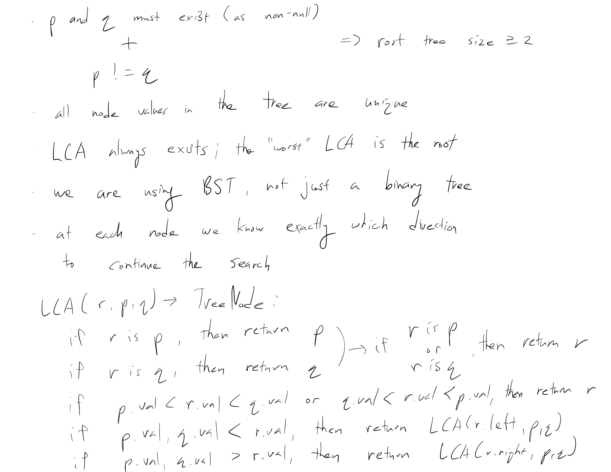
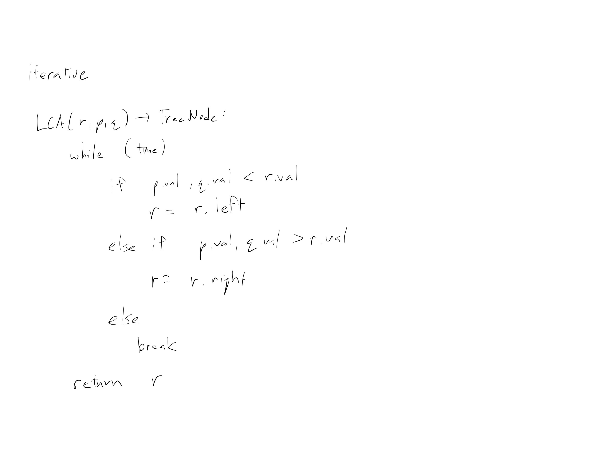

[Problem](https://leetcode.com/problems/lowest-common-ancestor-of-a-binary-search-tree/)

## takeaway
- BSTs has nice properties we can leverage on to simplify problems.
- Changing the order of if statements can make a difference.
- Do not ignore the space complexity involved with using recursion.

## take 1

- submission:
```java
public TreeNode lowestCommonAncestor(TreeNode root, TreeNode p, TreeNode q) {
    if (root.equals(p)
        || root.equals(q)
        || p.val < root.val && root.val < q.val
        || p.val > root.val && root.val > q.val) {
        return root;
    } else if (p.val < root.val && q.val < root.val) {
        return lowestCommonAncestor(root.left, p, q);
    } else { // p.val > root.val && q.val > root.val
        return lowestCommonAncestor(root.right, p, q);
    }
}
```
- Time
    - O(V)
- Space
    - average: O(log V)
    - worst: O(V)
- Result
    - Accepted
    - can clean up nested if else-if by changing the order

## take 2
- submission:
```java
public TreeNode lowestCommonAncestor(TreeNode root, TreeNode p, TreeNode q) {
    if (p.val < root.val && q.val < root.val) {
        return lowestCommonAncestor(root.left, p, q);
    } else if (p.val > root.val && q.val > root.val) {
        return lowestCommonAncestor(root.right, p, q);
    } else {
        return root;
    }
}
```
- Time
    - O(V)
- Space
    - average: O(log V)
    - worst: O(V)
- Result
    - Accepted
    - improve space complexity with iteration?

## take 3

- submission:
```java
public TreeNode lca(TreeNode root, TreeNode p, TreeNode q) {
    while (true) {
        if (p.val < root.val && q.val < root.val) {
            root = root.left;
        } else if (p.val > root.val && q.val > root.val) {
            root = root.right;
        } else {
            break;
        }
    }
    return root;
}
```
- Time
    - O(V)
- Space
    - O(1)
- Result
    - Accepted

## take 4
- code
```python
def lowest_common_ancestor(self, root, p, q):
    while True:
        if p.val < root.val and q.val < root.val:
            root = root.left
        elif p.val > root.val and q.val > root.val:
            root = root.right
        else:
            break
    return root
```
- Result
    - Accepted

