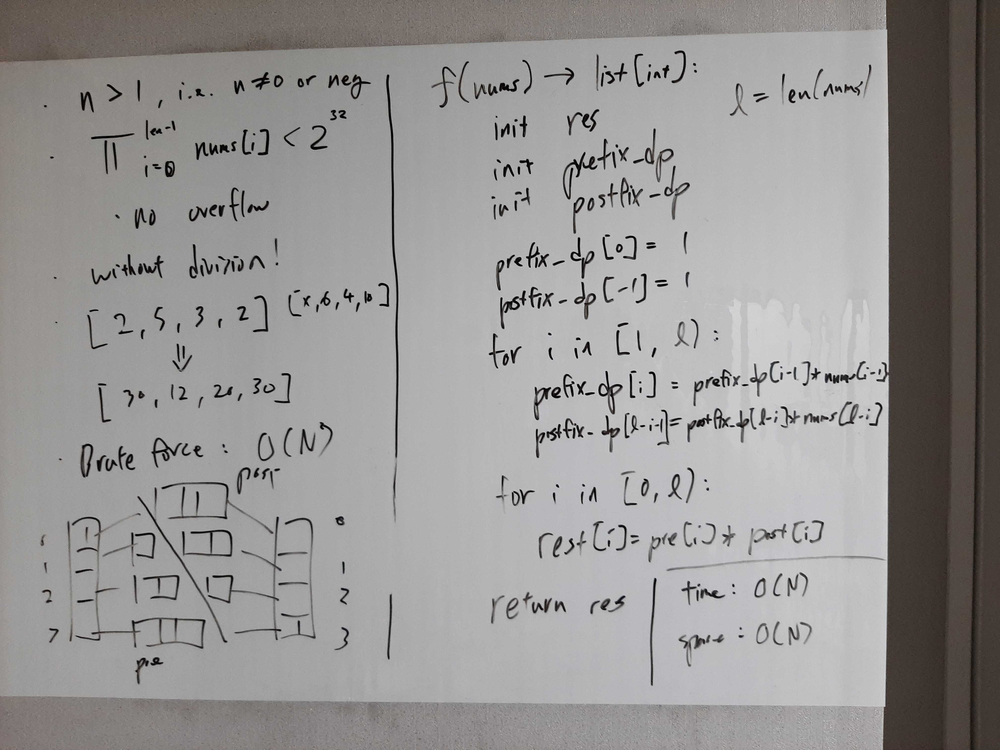
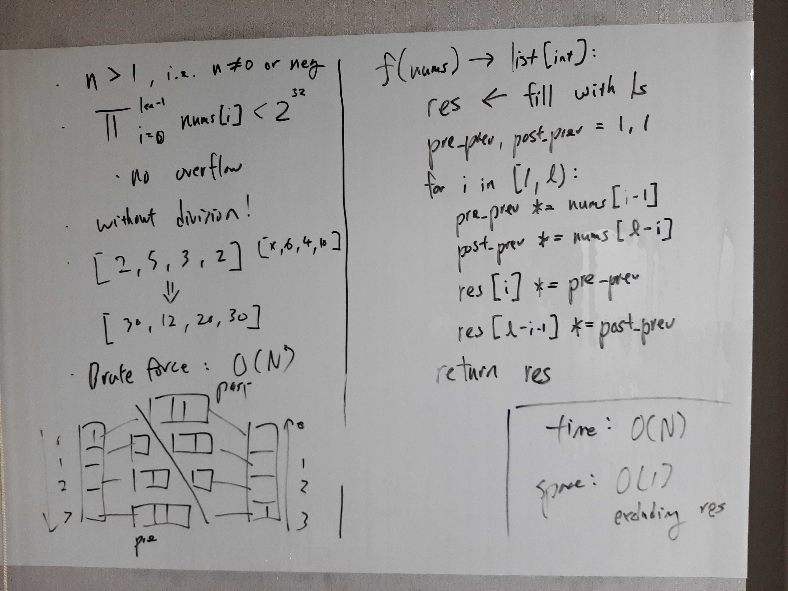

[Problem](https://leetcode.com/problems/product-of-array-except-self/)

## takeaway
- When solving DP, look for ways to accumulate previous results instead of
  storing them.
- In Python, avoid initializing "arrays" or tables, because it's slow!

## take 1

- code:
```python
def productExceptSelf(self, nums: List[int]) -> List[int]:
    l = len(nums)
    pre = collections.deque([1])
    post = collections.deque([1])
    for i in range(l - 1):
        pre.append(pre[-1] * nums[i])
        post.appendleft(post[0] * nums[l-i-1])
    return [x * y for x, y in zip(pre, post)]
```
- Result
    - Accepted

## take 2

- code:
```python
def productExceptSelf(self, nums: List[int]) -> List[int]:
    l = len(nums)
    res = [1 for _ in range(l)]
    pre_prev, post_prev = 1, 1
    for i in range(1, l):
        pre_prev *= nums[i - 1]
        post_prev *= nums[l - i]
        res[i] *= pre_prev
        res[l - i - 1] *= post_prev
    return res
```
- Result
    - Accepted

