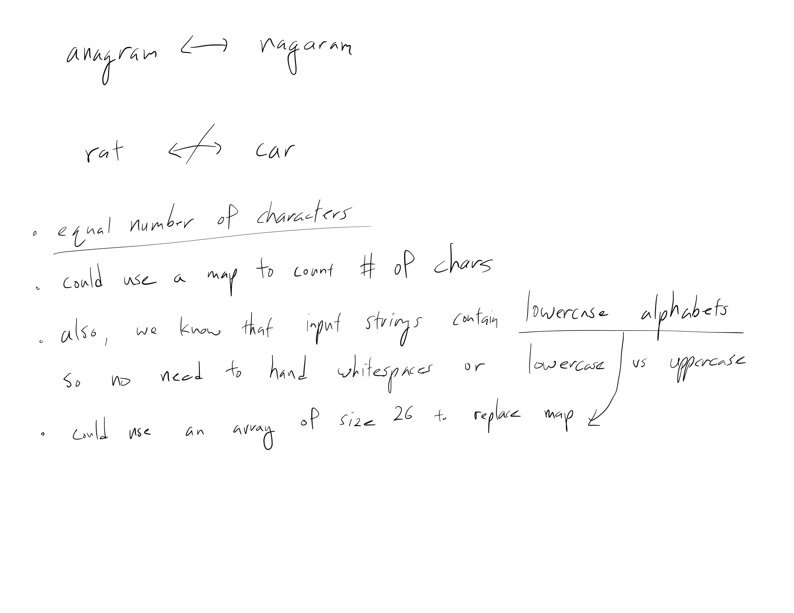
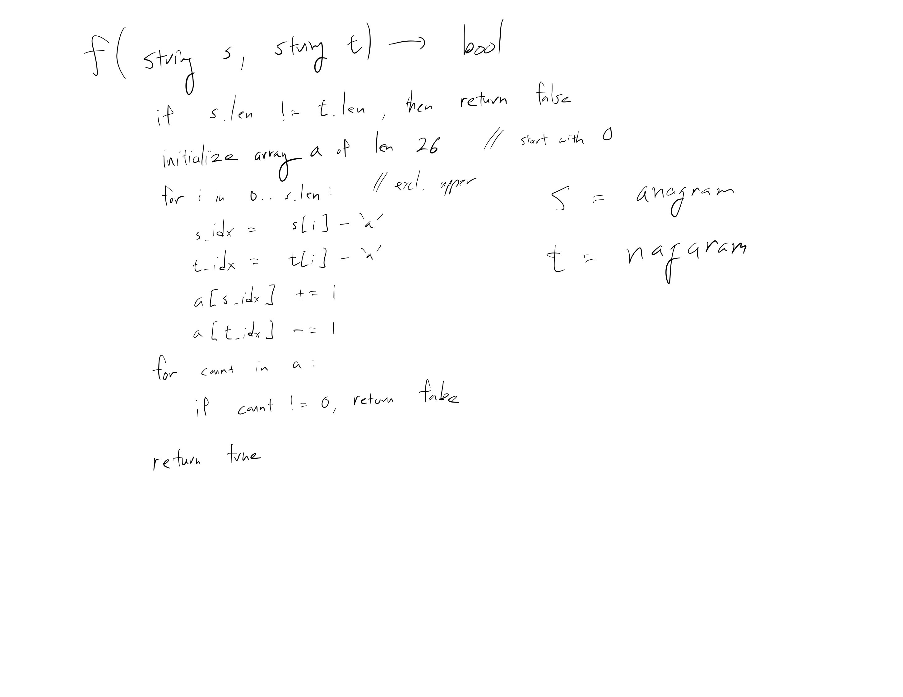
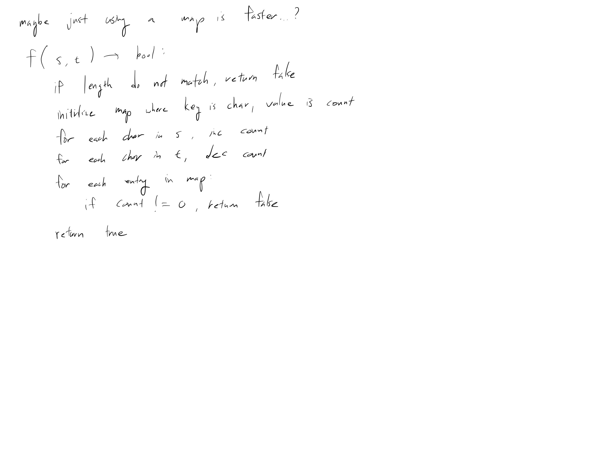

[Problem](https://leetcode.com/problems/valid-anagram/)

## takeaway
- Constant factors can make a difference in LeetCode submission performance.
- Using a map won't be faster than an array...

## take 1
- two strings are anagrams when they contain the same number of characters


- submission:
```java
public boolean isAnagram(String s, String t) {
    if (s.length() != t.length()) {
        return false;
    }
    int[] arr = new int[26];
    for (int i = 0; i < s.length(); i++) {
        int j = s.charAt(i) - 'a';
        int k = t.charAt(i) - 'a';
        arr[j] += 1;
        arr[k] -= 1;
    }
    for (int count : arr) {
        if (count != 0) {
            return false;
        }
    }
    return true;
}
```
- Time
    - linear, since sweeping the strings once
- Space
    - constant, since only extra memory used is for an array of length 26
- Result
    - Accepted
    - however, inefficient in both time and space
    - there should be a better solution...

## take 2
- maybe using a map is faster...?

- submission:
```java
public boolean isAnagram(String s, String t) {
    if (s.length() != t.length()) {
        return false;
    }
    Map<Character, Integer> map = new HashMap<>();
    for (int i = 0; i < s.length(); i++) {
        char x = s.charAt(i);
        char y = t.charAt(i);
        if (x != y) {
            int n = map.getOrDefault(x, 0);
            int m = map.getOrDefault(y, 0);
            map.put(x, n + 1);
            map.put(y, m - 1);
        }
    }
    for (int count : map.values()) {
        if (count != 0) {
            return false;
        }
    }
    return true;
}
```
- Time
    - linear, since sweeping the strings once
- Space
    - constant, since the map can contain only 26 entries at max
- Result
    - Accepted
    - however, even more inefficient in both time and space
    - there should be a better solution...

## take 3
- consider constant factors
- submission:
```java
public boolean isAnagram(String s, String t) {
    if (s.length() != t.length()) {
        return false;
    }
    int[] arr = new int[26];
    for (char c : s.toCharArray()) {
        arr[c - 'a']++;
    }
    for (char c : t.toCharArray()) {
        arr[c - 'a']--;
    }
    for (int count : arr) {
        if (count != 0) {
            return false;
        }
    }
    return true;
}
```
- Time
    - linear, since sweeping the strings once
- Space
    - constant, since the allocated array is of fixed size
- Result
    - Accepted
    - Although the approach iterates over the two input string separately, the
      performance loss is more than compensated for by the performance gain
      from using `toCharArray()`

## take 4
- code:
```python
is_anagram(self, s: str, t: str) -> bool:
    if len(s) != len(t):
        return False
    return Counter(s) == Counter(t)
```
- Result:
    - Accepted

