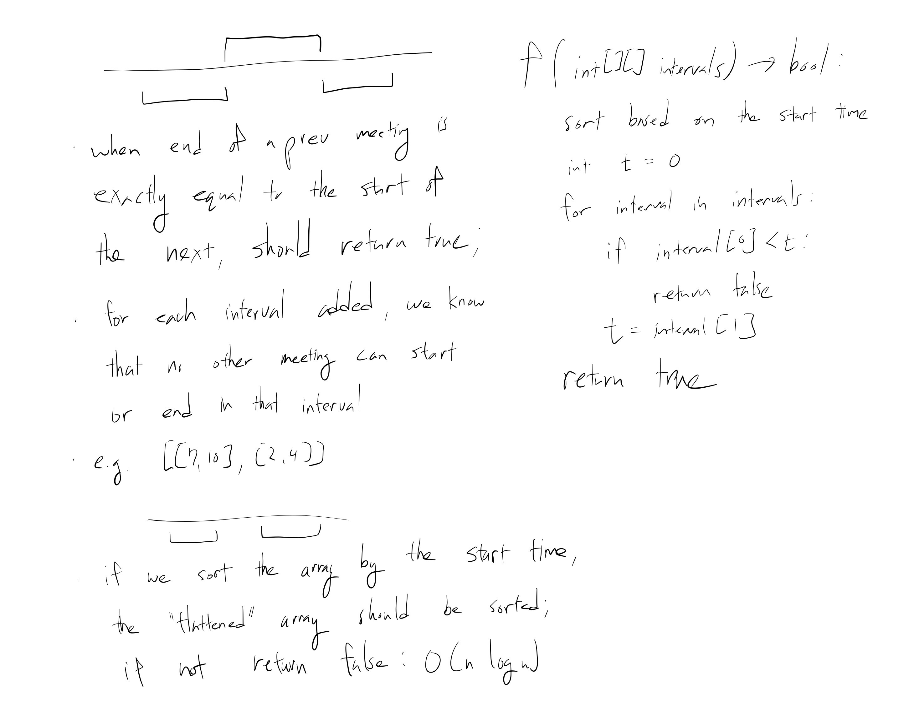

[Problem](https://leetcode.com/problems/meeting-rooms/)

## takeaway
- Given a quadratic brute force solution, linearithmic solution is often a good
  candidate.
- Space complexity of quicksort is O(log N)
- Space complexity of mergesort and Timsort is O(N)

## take 1
- sort the array in O(N log N); the solution then is trivial


- submission:
```java
public boolean canAttendMeetings(int[][] intervals) {
    Arrays.sort(intervals, (x, y) -> Integer.compare(x[0], y[0]));
    for (int i = 1; i < intervals.length; i++) {
        if (intervals[i - 1][1] > intervals[i][0]) {
            return false;
        }
    }
    return true;
}
```
- Time
    - O(N log N), because sort
- Space
    - Depends on the sorting algorithm
    - O(log N) for quicksort
    - O(n) for mergesort or Timsort
    - Since Java's Array.sort(Object[]) uses Timsort, probably O(N)
- Result
    - Accepted

## take 2
- code
```python
def can_attend_meetings(self, intervals: list[list[int]]) -> bool:
    intervals.sort(key=lambda interval : interval[0]) # sort by start time
    return all(x[1] <= y[0] for x, y in zip(interval[:-1], interval[1:]))
```
- Result
    - Accepted

