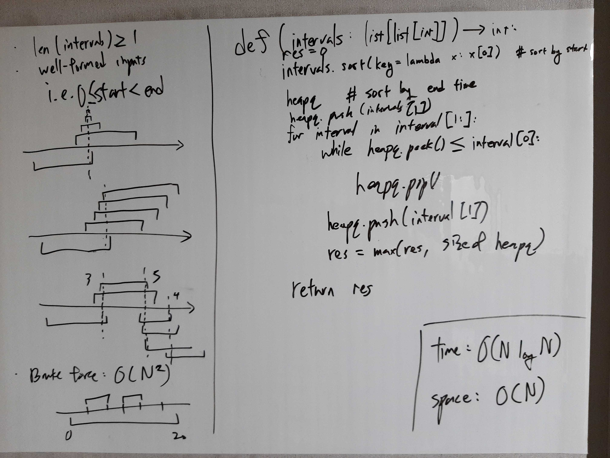

[Problem](https://leetcode.com/problems/meeting-rooms-ii/)

## takeaway
- Sorting on different components of an object, e.g. start time vs end time,
  can lead to some nice solutions.
- Use heapq / OrderedDict / PriorityQueue / TreeMap / TreeSet for O(log N)
  insertions and accesses.

## take 1

- code:
```python
def minMeetingRooms(self, intervals: List[List[int]]) -> int:
    res = 0
    intervals.sort(key=lambda interval: interval[0])  # sort by start time
    hq = []  # min heapq of end time
    for interval in intervals:
        start, end = interval
        while hq and hq[0] <= start:
            heapq.heappop(hq)
        heapq.heappush(hq, end)
        res = max(res, len(hq))
    return res
```
- Time
    - O(N log N)
- Space
    - O(N)
- Result
    - Accepted

