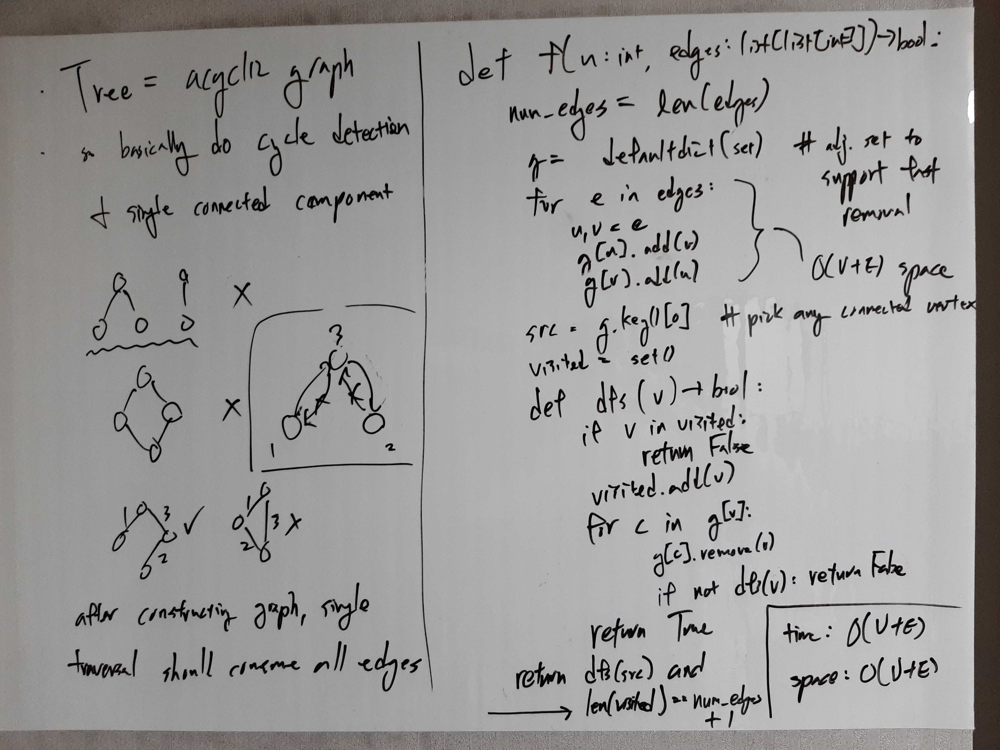

[Problem](https://leetcode.com/problems/graph-valid-tree/)

## takeaway
- A graph is a tree iff:
    1. it is fully connected.
        - i.e. a single traversal visits all nodes.
        - i.e. the size of the visited set equals the number of nodes.
    2. it contains no cycle.
        - i.e. no node is visited more than once in a traversal.
- A tree has exactly V - 1 edges.
- Undirected edges can be represented as 2 directed edges + special handling.

## take 1

- code:
```python
def validTree(self, n: int, edges: List[List[int]]) -> bool:
    def has_cycle(v) -> bool:
        if v in visited:
            return True
        visited.add(v)
        for c in g[v]:
            g[c].remove(v)
            if has_cycle(c):
                return True
        return False

    # if V != E + 1, not a tree
    if n != len(edges) + 1:
        return False

    # initialize an adjacency set that supports efficient removals
    g = defaultdict(set)
    for e in edges:
        u, v = e
        g[u].add(v)
        g[v].add(u)

    src = 0  # pick any vertex
    visited = set()
    return not has_cycle(src) and len(visited) == n
```
- Time: O(N)
    - V = N and E = V - 1 ~ N if valid tree.
    - Graph traversal takes O(V + E) = O(N).
    - Adjacency set initialization takes O(E) = O(N).
- Space: O(N)
    - Adjacency set is O(E) = O(N).
    - DFS recursion depth is O(H) <= O(N).
- Result: Accepted

