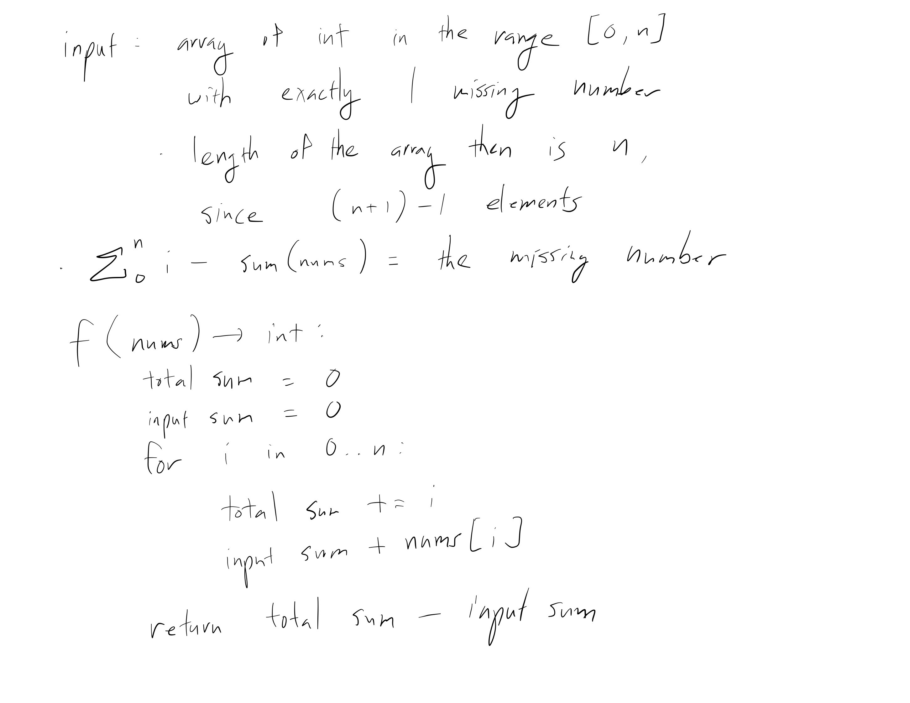

[Problem](https://leetcode.com/problems/missing-number/)

## takeaway
- Reducing the elements of an array / collection can reveal useful info.

## take 1

- submission:
```java
public int missingNumber(int[] nums) {
    int n = nums.length;
    int totalSum = n;
    int inputSum = 0;
    for (int i = 0; i < n; i++) {
        totalSum += i;
        inputSum += nums[i];
    }
    return totalSum - inputSum;
}
```
- Time
    - O(N)
- Space
    - O(1)
- Result
    - Accepted
    - using XOR instead of sum is also viable

## take 2
- code
```python
def missing_number(self, nums: list[int]) -> int:
    _all, inp = reduce(lambda x, y: list(map(add, x, y)), enumerate(nums))
    _all += len(nums)
    return _all - inp
```
- Result
    - Accepted

## take 3
- code
```python
def missing_number(self, nums: list[int]) -> int:
    n = len(nums)
    _all = n * (n + 1) // 2
    return _all - sum(nums)
```
- Result
    - Accepted
- Note
    - Leverage on the math that sum from 1 to n is n * (n + 1) // 2

