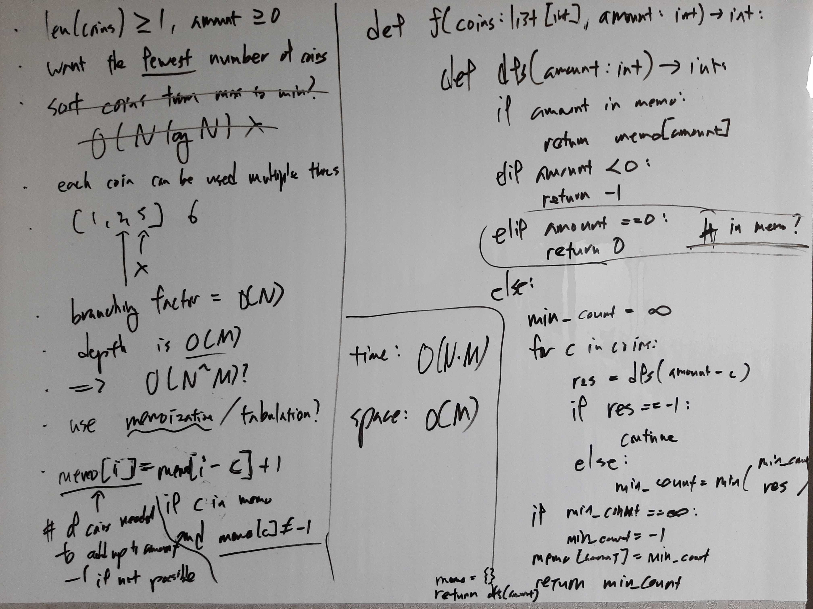

[Problem](https://leetcode.com/problems/coin-change/)

## Algorithm Classification
- DP

## Takeaways
- Use a special value encoding if the value interferes with the operations we
  want to perform.
    - e.g. `min()` will break if the special value is -1.

## Take 1
- Approach
    - Top-down memoization DP.


- Code
```python
def coinChange(self, coins: List[int], amount: int) -> int:
    def dfs(rem: int) -> int:
        if rem in memo:
            return memo[rem]
        elif rem < 0:
            return float('inf')
        else:
            rest_min_count = min(dfs(rem - c) for c in coins)
            min_count = 1 + rest_min_count if rest_min_count != float('inf') else float('inf')
            memo[rem] = min_count
            return min_count

    memo = {c: 1 for c in coins}
    memo[0] = 0
    res = dfs(amount)
    return res if res != float('inf') else -1
```
- Time: O(M * N)
    - M := amount, N := len(coins)
    - Recursion depth can grow upto O(M).
    - Branching factor is O(N).
- Space: O(M)
    - Memo cache can grow upto O(M).
    - Recursion depth can grow upto O(M).
- Result: Accepted

## Take 2
- Approach
    - Bottom-up tabulation DP.
- Code
```python
def coinChange(self, coins: List[int], amount: int) -> int:
    dp = [float('inf') for _ in range(amount + 1)]
    dp[0] = 0
    for c in filter(lambda c: c <= amount, coins):
        dp[c] = 1
    for i in range(amount + 1):
        if dp[i] != float('inf'):
            continue
        rest_min_count = float('inf')
        for c in filter(lambda c: i - c > 0, coins):
            rest_min_count = min(rest_min_count, dp[i - c])
        dp[i] = 1 + rest_min_count if rest_min_count != float('inf') else float('inf')

    res = dp[amount]
    return res if res != float('inf') else -1
```
- Time: O(M * N)
    - M := amount, N := len(coins)
    - O(M) iterations.
    - O(N) coins to check for each iteration.
- Space: O(M)
    - Size of DP table is O(M).
- Result: Accepted

