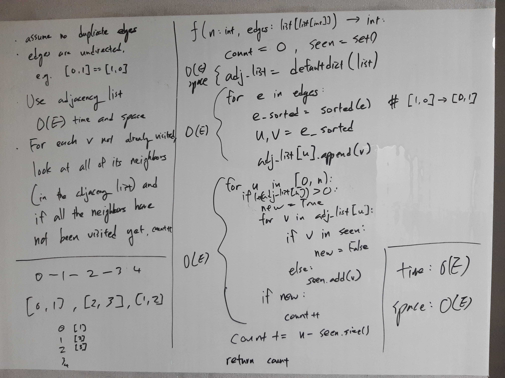
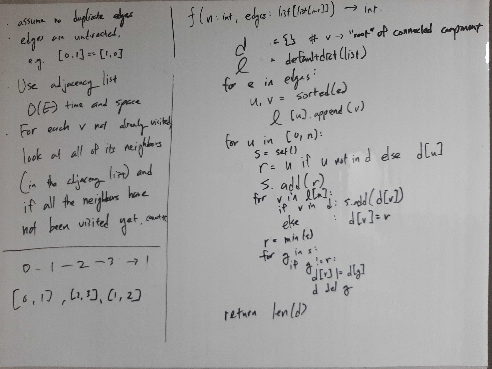

[Problem](https://leetcode.com/problems/number-of-connected-components-in-an-undirected-graph/)

## takeaway
- Always try to identify / classify the approach you're taking.
- Be thorough with edge cases; can't let something like take 1 happen again.

## take 1

- code:
```python
def countComponents(self, n: int, edges: List[List[int]]) -> int:
    count = 0
    seen = set()
    adj_list = defaultdict(list)

    # initialize adjacency list
    for e in edges:
        e_sorted = sorted(e)  # unnecessary if edges are given sorted
        u, v = e_sorted
        adj_list[u].append(v)

    # increment count if u belongs in a new connected component
    for u in range(n):
        neighbors = adj_list[u]
        new = u not in seen
        seen.add(u)
        for v in neighbors:
            if v in seen:
                new = False
            else:
                seen.add(v)
        if new:
            count += 1

    return count
```
- Result
    - Wrong Answer
- Note
    - This code fails to account for the cases where two connected component
      are joined by an edge, e.g. (1, 2), (3, 4), (2, 3).

## take 2

- code:
```python
def countComponents(self, n: int, edges: List[List[int]]) -> int:
v_to_r = {}  # dict[vertex:"root" of connected component]
    l = defaultdict(list)  # adjacency list

    # initialize adjacency list
    for e in edges:
        u, v = sorted(e)  # sorting unnecessary if given sorted
        l[u].append(v)

    for u in range(n):
        s = set()  # set of "roots" connected to u
        r = u if u not in v_to_r else v_to_r[u]
        v_to_r[u] = r
        s.add(r)
        for v in l[u]:
            if v in v_to_r:
                s.add(v_to_r[v])
            else:
                v_to_r[v] = r

        # component root; merge all component groups with the root
        r = min(s)  # set the "root" to be the min vertex
        for cr in s:
            for k, v in v_to_r.items():
                if v == cr:
                    v_to_r[k] = r

    return len(set(v_to_r.values()))  # return the number of unique roots
```
- Result
    - Accepted
- Note
    - Although accepted, time complexity is O(V^2 + E) due to inefficient
      updates of the new root value for all vertices.
    - In retrospect, I did try to utilize the concept of union find without
      recognizing it.

## take 3
- BFS
- code:
```python
def countComponents(self, n: int, edges: List[List[int]]) -> int:
    count = 0
    seen = set()

    adj_l = defaultdict(list)
    for e in edges:
        u, v = e
        adj_l[u].append(v)
        adj_l[v].append(u)

    for u in range(n):
        if u in seen:
            continue
        queue = collections.deque()
        queue.appendleft(u)
        while queue:
            v = queue.pop()
            if v not in seen:
                seen.add(v)
                for w in adj_l[v]:
                    queue.appendleft(w)
        count += 1

    return count
```
- Result
    - Accepted
- Note
    - O(V + E) time and space complexity.
    - DFS would have been equally valid.

## take 4
- Union Find
- code:
```python
def countComponents(self, n: int, edges: List[List[int]]) -> int:
    def union(u: int, v:int) -> None:
        u = find(u)
        v = find(v)
        if u != v:
            roots[u] = v

    def find(v: int) -> int:
        while v != roots[v]:
            roots[v] = roots[roots[v]]  # path compression
            v = roots[v]
        return v

    roots = [i for i in range(n)]
    for e in edges:
        u, v = e
        union(u, v)
    return len({find(v) for v in roots})
```
- Result
    - Accepted
- Note
    - Time Complexity = O(V + E log E), since not using union by rank.
    - Space Complexity = O(V + E), including the input `edges` list.

