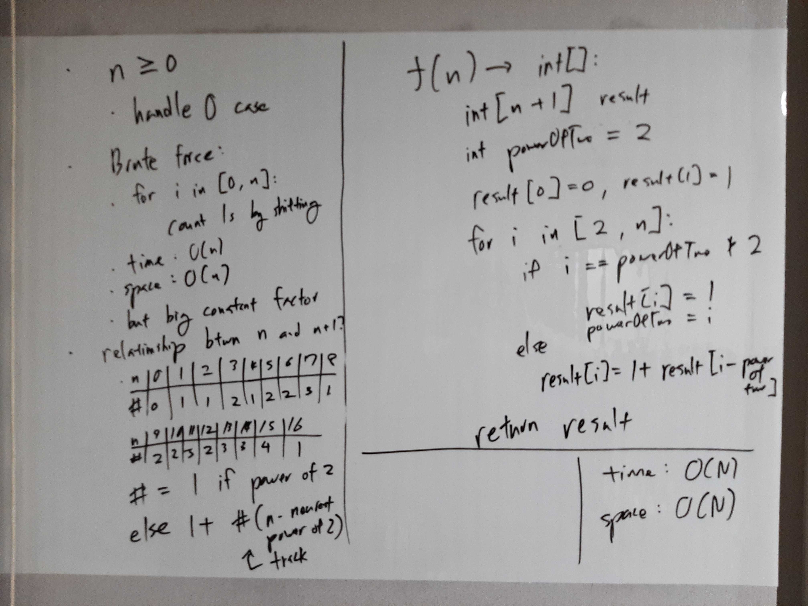

[Problem](https://leetcode.com/problems/counting-bits/)

## takeaway
- Discover the relationship between subproblems.

## take 1

- code:
```java
public int[] countBits(int num) {
    int[] result = new int[num + 1];
    result[0] = 0;
    if (num == 0) {
        return result;
    }
    result[1] = 1;
    int powerOfTwo = 1;
    for (int i = 2; i <= num; i++) { // inclusive
        if (i == powerOfTwo << 1) {
            result[i] = 1;
            powerOfTwo <<= 1;
        } else {
            result[i] = 1 + result[i - powerOfTwo];
        }
    }
    return result;
}
```
- Result
    - Accepted

## take 2
- Python version
```python
def countBits(self, num: int) -> List[int]:
    res = [0]
    if num == 0:
        return res
    res.append(1)
    curr = 1
    for i in range(2, num + 1):
        if i == curr * 2:
            res.append(1)
            curr = i
        else:
            res.append(res[curr] + res[i - curr])
    return res
```
- Time
    - O(N)
- Space
    - O(N)
- Result
    - Accepted

