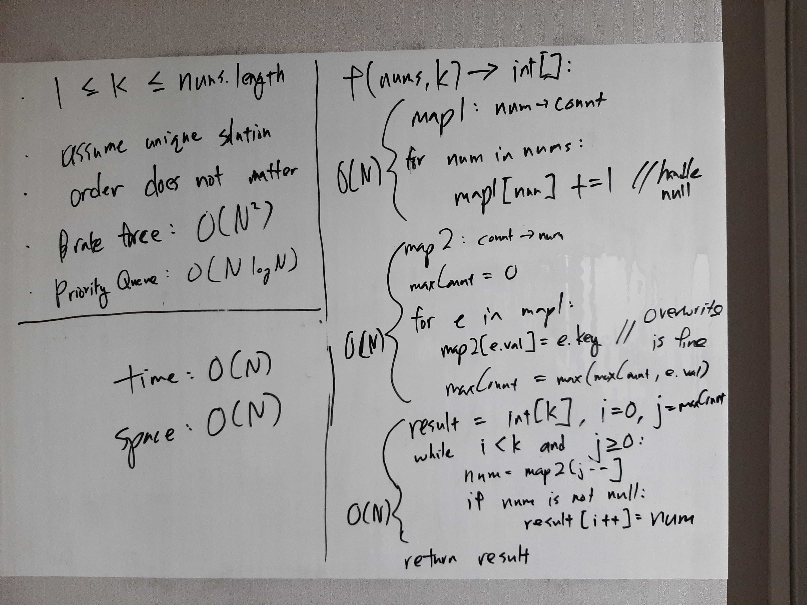

[Problem](https://leetcode.com/problems/top-k-frequent-elements/)

## takeaway
- `Map<K, V>` -> `Map<V, Set<K>>` can yield some nice properties.

## take 1

- code:
```java
public int[] topKFrequent(int[] nums, int k) {
    Map<Integer, Integer> numToCountMap = new HashMap<>();
    for (int num : nums) {
        numToCountMap.put(num, numToCountMap.getOrDefault(num, 0) + 1);
    }

    Map<Integer, Integer> countToNumMap = new HashMap<>();
    int maxCount = 0;
    for (Map.Entry<Integer, Integer> e : numToCountMap.entrySet()) {
        int num = e.getKey();
        int count = e.getValue();
        countToNumMap.put(count, num); // overwriting is fine
        maxCount = Math.max(maxCount, count);
    }

    int[] result = new int[k];
    int i = 0;
    int j = maxCount;
    while (i < k && j >= 0) {
        if (countToNumMap.containsKey(j)) {
            result[i++] = countToNumMap.get(j);
        }
        j--;
    }
    return result;
}
```
- Result
    - Wrong Answer
- Note
    - actually, overwriting entries in countToNumMap is not fine, because it
      is possible for numbers of the same frequency to be returned

## take 2
- code:
```java
public int[] topKFrequent(int[] nums, int k) {
    Map<Integer, Integer> numToCountMap = new HashMap<>();
    for (int num : nums) {
        numToCountMap.put(num, numToCountMap.getOrDefault(num, 0) + 1);
    }

    Map<Integer, Set<Integer>> countToNumsMap = new HashMap<>();
    int maxCount = 0;
    for (Map.Entry<Integer, Integer> e : numToCountMap.entrySet()) {
        int num = e.getKey();
        int count = e.getValue();
        Set<Integer> set = countToNumsMap.get(count);
        if (set == null) {
            set = new HashSet<>();
            countToNumsMap.put(count, set);
        }
        set.add(num);
        maxCount = Math.max(maxCount, count);
    }

    int[] result = new int[k];
    int i = 0;
    int j = maxCount;
    while (i < k && j >= 0) {
        if (countToNumsMap.containsKey(j)) {
            for (int num : countToNumsMap.get(j)) {
                result[i++] = num;
            }
        }
        j--;
    }
    return result;
}
```
- Result
    - Accepted

## take 3
- Python version
- code:
```python
def topKFrequent(self, nums: List[int], k: int) -> List[int]:
    c = Counter(nums)

    bins = [None for _ in range(len(nums))]
    for key, val in c.items():
        if not bins[val - 1]:
            bins[val - 1] = []
        bins[val - 1].append(key)

    res = []
    for i in range(len(nums) - 1, -1, -1):
        curr_bin = bins[i]
        if curr_bin:
            res += curr_bin
            k -= len(curr_bin)
            if k == 0:
                break
    return res
```
- Time
    - O(N)
- Space
    - O(N)
- Result
    - Accepted

