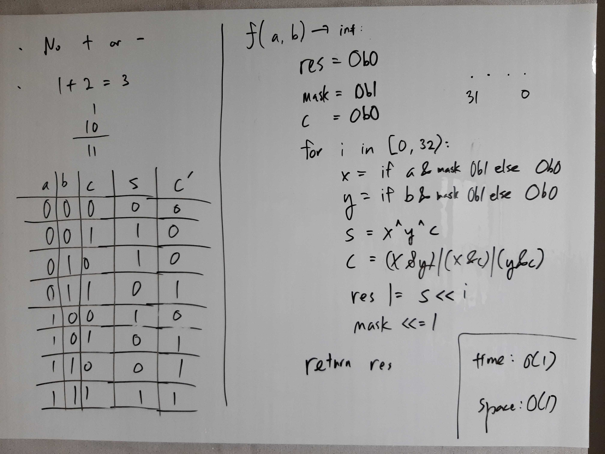

[Problem](https://leetcode.com/problems/sum-of-two-integers/)

## takeaway
- Just like an adder in a CPU.
- Don't use Python for two's complement bit manipulation stuff.

## take 1

- code:
```java
public int getSum(int a, int b) {
    int res = 0b0;
    int mask = 0b1;
    int carry = 0b0;
    for (int i = 0; i < 32; i++) {
        int x = (a & mask) == 0 ? 0b0 : 0b1;
        int y = (b & mask) == 0 ? 0b0 : 0b1;
        int s = x ^ y ^ carry;
        carry = (x & y) | (x & carry) | (y & carry);
        res |= s << i;
        mask <<= 1;
    }
    return res;
}
```
- Result
    - Accepted

