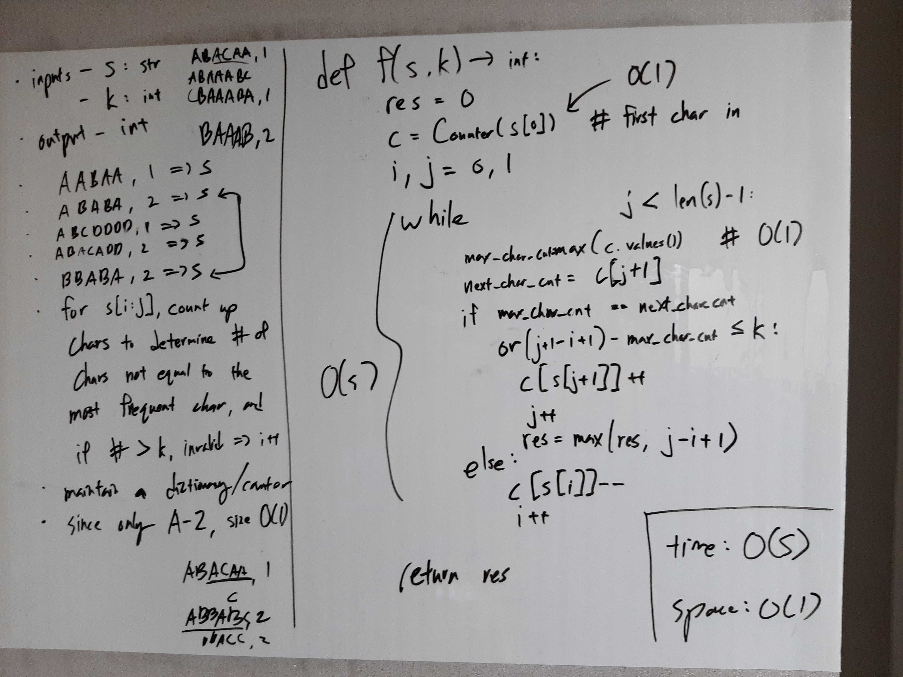

[Problem](https://leetcode.com/problems/longest-repeating-character-replacement/)

## takeaway
- Always strive to find a more efficient solution before implementing what you
  got.
    - Although the brute force solution is cubic for this problem, the optimal
      solution turned out to be linear, not quadratic.
- Applying two pointer / sliding window technique likely requires insight on
  the structure of the subproblems.
    - e.g. for this problem, you have to realize that if `s[i:j]` contains more
      than k characters different from the most common character, `s[i:k]` for
      k > j will also contain more than k different characters, and therefore
      incrementing i and sliding / narrowing the window is valid.

## take 1
- code:
```python
def characterReplacement(self, s: str, k: int) -> int:
    res = 0
    l = len(s)
    for mid in range(l):
        c = s[mid]

        # mid to bot
        rem = k
        bot = mid - 1
        while bot >= 0 and (s[bot] == c or rem > 0):
            if s[bot] != c:
                rem -= 1
            bot -= 1
        res = max(res, mid - bot)  # (mid - (bot + 1)) + 1

        # mid to top
        rem = k
        top = mid + 1
        while top < l and (s[top] == c or rem > 0):
            if s[top] != c:
                rem -= 1
            top += 1
        res = max(res, top - mid)  # ((top - 1) - bot) + 1
    return res
```
- Time
    - O(S^2)
- Space
    - O(1)
- Result
    - Wrong Answer
- Note
    - This approach does not expand in both directions and fails to handle
      cases like "BAAAB".

## take 2
- code:
```python
def characterReplacement(self, s: str, k: int) -> int:
    res = 0
    l = len(s)
    for mid in range(l):
        c = s[mid]

        # mid to bot
        rem = k
        bot = mid - 1
        while bot >= 0 and (s[bot] == c or rem > 0):
            if s[bot] != c:
                rem -= 1
            bot -= 1
        if rem:
            top = mid + 1
            while top < l and (s[top] == c or rem > 0):
                if s[top] != c:
                    rem -= 1
                top += 1
            mid = top - 1
        res = max(res, mid - bot)  # (mid - (bot + 1)) + 1

        # mid to top
        rem = k
        top = mid + 1
        while top < l and (s[top] == c or rem > 0):
            if s[top] != c:
                rem -= 1
            top += 1
        if rem:
            bot = mid - 1
            while bot >= 0 and (s[bot] == c or rem > 0):
                if s[bot] != c:
                    rem -= 1
                bot -= 1
            mid = bot + 1
        res = max(res, top - mid)  # ((top - 1) - bot) + 1
    return res
```
- Time
    - O(S^2)
- Space
    - O(1)
- Result
    - Time Limit Exceeded
- Note
    - Quadratic is not good enough!

## take 3
- Sliding window / two pointer solution

- code:
```python
def characterReplacement(self, s: str, k: int) -> int:
    res = 0
    if not s:
        return res
    d = defaultdict(int)
    d[s[0]] = 1
    i, j = 0, 0
    while j < len(s) - 1:
        max_char_cnt = max(d.values())
        next_char = s[j + 1]
        next_char_cnt = d[next_char]
        len_substr = j + 1 - i + 1
        if max_char_cnt == next_char_cnt or len_substr - max_char_cnt <= k:
            d[next_char] += 1
            j += 1
            res = max(res, len_substr)
        else:
            d[s[i]] -= 1
            i += 1
    return res
```
- Time
    - O(S)
- Space
    - O(1)
- Result
    - Accepted

