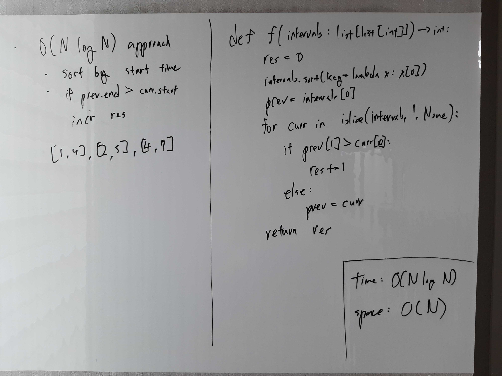
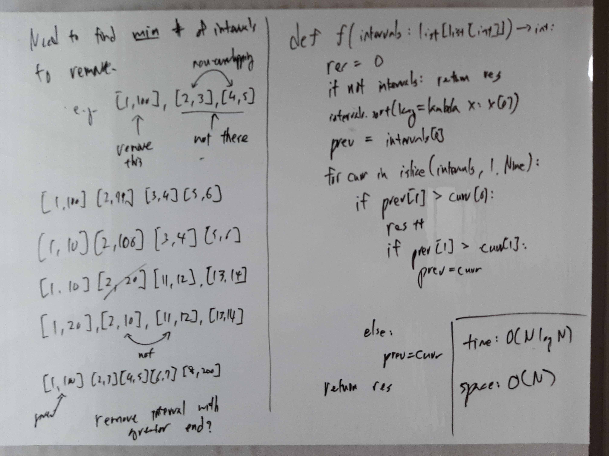

[Problem](https://leetcode.com/problems/non-overlapping-intervals/)

## takeaway
- Try to reason about how to make the locally optimal choices to formulate a
  greedy algorithm.
- Handle edge cases like an empty input after thoroughly checking the
  constraints.

## take 1

- code:
```python
def eraseOverlapIntervals(self, intervals: List[List[int]]) -> int:
    res = 0
    if not intervals:
        return res
    intervals.sort(key=lambda interval: interval[0])  # sort by start time
    prev = intervals[0]
    for curr in islice(intervals, 1, None):
        if prev[1] > curr[0]:
            res += 1
        else:
            prev = curr
    return res
```
- Time: O(N log N)
    - O(N log N) for sorting.
    - O(N) for scanning and processing the list.
- Space: O(N)
    - O(N) for sorting (Timsort)
- Result: Wrong Answer
- Note
    - We need to find the **minimum** number of intervals to remove.

## take 2
- Greedy

- code:
```python
def eraseOverlapIntervals(self, intervals: List[List[int]]) -> int:
    res = 0
    if not intervals:
        return res
    intervals.sort(key=lambda interval: interval[0])  # sort by start time
    prev = intervals[0]
    for curr in islice(intervals, 1, None):
        if prev[1] > curr[0]:
            res += 1
            if prev[1] > curr[1]:
                prev = curr
        else:
            prev = curr
    return res
```
- Time: O(N log N)
    - O(N log N) for sorting.
    - O(N) for scanning and processing the list.
- Space: O(N)
    - O(N) for sorting (Timsort)
- Result: Accepted
- Note
    - The greedy approach works because given the intervals are sorted by start
      times, it is always correct to keep the interval with the earlier end in
      the case of overlapping intervals.

