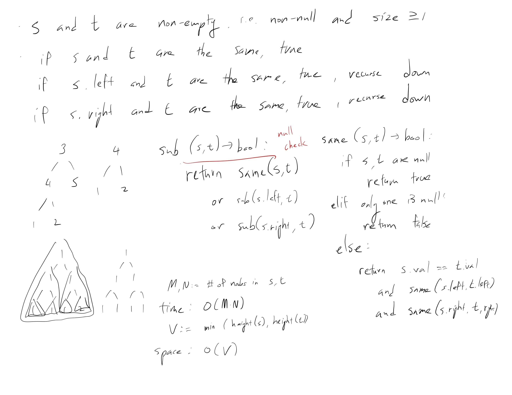

[Problem](https://leetcode.com/problems/subtree-of-another-tree/)

## takeaway
- Another way a problem can be composed of different subproblems.
- Be careful with null pointers.
- When given two inputs, incorporate both into time and space complexity
  analysis.

## take 1

- code:
```java
public boolean isSubtree(TreeNode s, TreeNode t) {
    return isSameTree(s, t)
        || isSubtree(s.left, t)
        || isSubtree(s.right, t);
}

private boolean isSameTree(TreeNode s, TreeNode t) {
    if (s == null && t == null) {
        return true;
    } else if (s == null || t == null) {
        return false;
    } else {
        return s.val == t.val
            && isSameTree(s.left, t.left)
            && isSameTree(s.right, t.right);
    }
}
```
- Result
    - Runtime Error - NullPointerException
- Note
    - forgot to null check `s`

## take 2
- code:
```java
public boolean isSubtree(TreeNode s, TreeNode t) {
    if (s == null) { // t is non-null
        return false;
    } else {
        return isSameTree(s, t)
            || isSubtree(s.left, t)
            || isSubtree(s.right, t);
    }
}

private boolean isSameTree(TreeNode s, TreeNode t) {
    if (s == null && t == null) {
        return true;
    } else if (s == null || t == null) {
        return false;
    } else {
        return s.val == t.val
            && isSameTree(s.left, t.left)
            && isSameTree(s.right, t.right);
    }
}
```
- Result
    - Accepted

## take 3
- Python version
- code:
```python
def isSubtree(self, s: TreeNode, t: TreeNode) -> bool:
    if not s:  # t is never None
        return False
    else:
        return (self.isSameTree(s, t)
                or self.isSubtree(s.left, t)
                or self.isSubtree(s.right, t))

def isSameTree(self, s: TreeNode, t: TreeNode) -> bool:
    if not s and not t:
        return True
    elif not s or not t:
        return False
    else:
        return (s.val == t.val
                and self.isSameTree(s.left, t.left)
                and self.isSameTree(s.right, t.right))
```
- Time
    - O(S * T)
- Space
    - O(H)
- Result
    - Accepted

