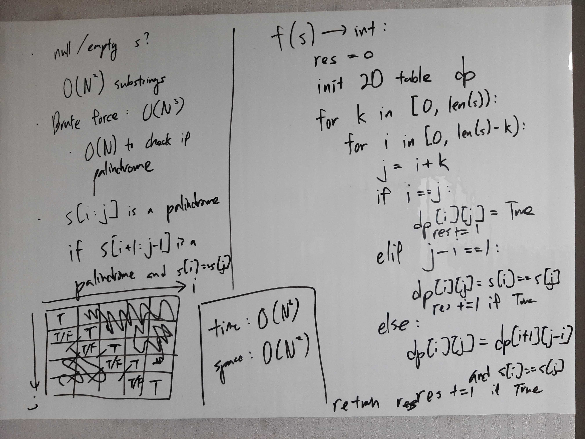
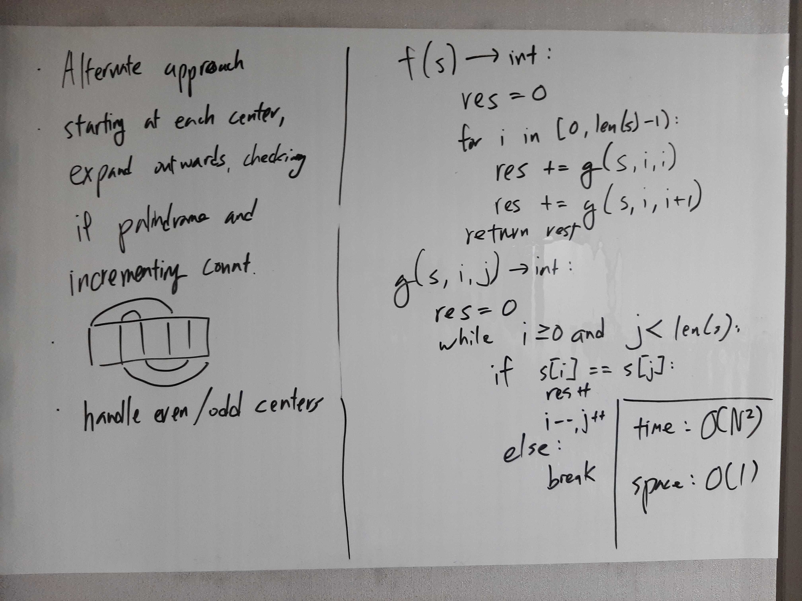

[Problem](https://leetcode.com/problems/palindromic-substrings/)

## takeaway
- There are different ways to define subproblems.
    - For example, take 1 defines the subproblem to determine whether a
      substring s[i:j] is a palindrome.
    - On the other hand, take 2 defines the subproblem to solve for the count
      of palindromic substrings with centers i and j.
    - The two approaches are essentially solving the same subproblems in
      different order, where take 2 uses only a single accumulator variable,
      whereas take 1 stores the result of all the subproblems.

## take 1

- code:
```python
def countSubstrings(self, s: str) -> int:
    res = 0
    n = len(s)
    dp = [[False for _ in range(n)] for _ in range(n)]
    for k in range(n):
        for i in range(n - k):
            j = i + k
            if i == j:
                dp[i][j] = True
                res += 1
            elif j - i == 1:
                if s[i] == s[j]:
                    dp[i][j] = True
                    res += 1
            else:
                if s[i] == s[j] and dp[i+1][j-1]:
                    dp[i][j] = True
                    res += 1
    return res
```
- Result
    - Accepted
- Note
    - A bit slow, and space inefficient...

## take 2

- code:
```python
def countSubstrings(self, s: str) -> int:
    res = 0
    n = len(s) - 1
    for i in range(n):
        res += self.helper(s, i, i)
        res += self.helper(s, i, i + 1)
    res += self.helper(s, n, n)
    return res

def helper(self, s: str, i:int, j:int) -> int:
    res = 0
    while i >= 0 and j < len(s):
        if s[i] == s[j]:
            res += 1
            i -= 1
            j += 1
        else:
            break
    return res
```
- Result
    - Accepted

